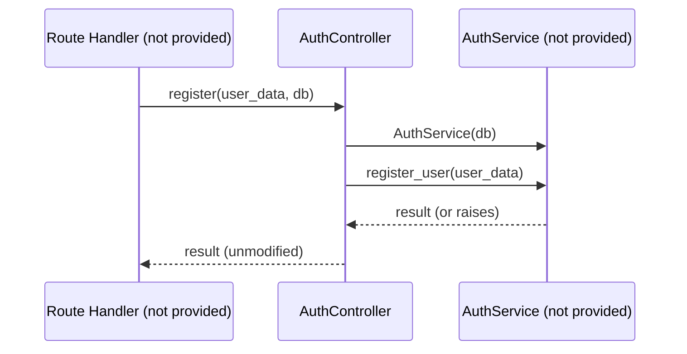
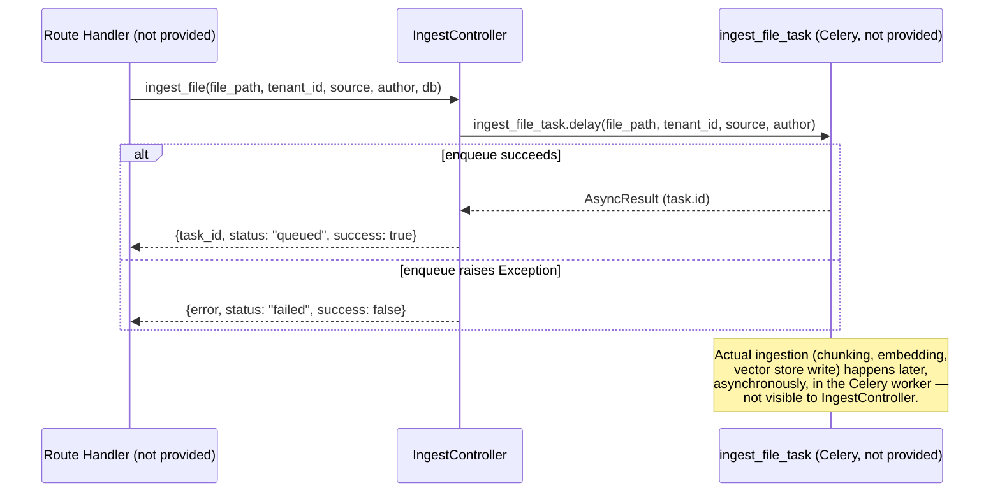

# Atlas AI — Controllers Module (`app/controllers`)

## Overview

This module contains two thin controller classes that sit between API route handlers (not provided) and service-layer business logic (not provided). Based strictly on the two files supplied:

- `auth_controller.py` — `AuthController`, delegating registration and login to `AuthService`.
- `ingest_rag_controller.py` — `IngestController`, delegating RAG document ingestion to a Celery task.

Both controllers are extremely thin: they contain no business logic themselves, only construction/invocation of a service or task and pass-through of the result. No route definitions, request/response models beyond the imported schema names, service implementations, or Celery task implementations were included in the provided files — these are documented below as **Referenced but not provided**.

## Responsibilities

- Provide a stable call surface (`AuthController.register`, `AuthController.login`, `IngestController.ingest_file`) that a route layer can invoke, decoupling route handlers from direct service/task instantiation.
- `AuthController` instantiates `AuthService` per call, scoped to the passed-in `db: Session`.
- `IngestController` dispatches ingestion work asynchronously to Celery via `.delay(...)` rather than doing any ingestion work synchronously in-process, and normalizes the outcome (queued vs. failed-to-enqueue) into a plain dict.

## Boundaries

- Controllers do not validate input themselves — `UserCreate`/`UserLogin` (Pydantic schemas, not provided) are assumed to already be validated by the time they reach `AuthController`, implying validation happens at the route layer via FastAPI's request-body parsing.
- Controllers do not manage the `Session` lifecycle — a `db: Session` is passed in as an argument, implying the caller (a route handler using `Depends(get_db)`, per the `app/core` module documented separately) owns session creation/teardown.
- `IngestController` does not perform ingestion itself; it only enqueues a Celery task and reports whether enqueuing succeeded. It has no visibility into whether the task itself later succeeds or fails.
- Neither controller performs authentication/authorization checks, rate limiting, or tenant-boundary enforcement — these responsibilities (documented in the separately analyzed `app/core` module) are not invoked here, and are presumably applied at the route layer.

## Project Structure

```
app/controllers/
├── auth_controller.py           # AuthController: register / login
├── ingest_rag_controller.py     # IngestController: enqueue RAG ingestion task
└── README.md                    # (pre-existing documentation file, not analyzed as source code)
```

> Note: A `README.md` already existed in the provided archive. This document is freshly generated per the current request and does not treat the prior file's content as authoritative.

---

## How It Works

There is no route layer, service layer, or task implementation in the provided files, so the full request lifecycle cannot be documented end-to-end. What follows is exactly what each controller does with its inputs.

## File-by-File Explanation

### `auth_controller.py`

**Responsibility:** Bridge between a (not-provided) auth route and `AuthService`.

**Important Components:**
- `AuthController` — a class with two `@staticmethod` methods, never instantiated.
- `register(user_data: UserCreate, db: Session)`:
  - Instantiates `AuthService(db)` — a new service instance per call, bound to the given session.
  - Calls and returns `service.register_user(user_data)` directly — no additional transformation, error handling, or logging.
- `login(user_data: UserLogin, db: Session)`:
  - Instantiates `AuthService(db)`.
  - Calls and returns `service.login_user(user_data.email, user_data.password)` — note this unpacks `email`/`password` from the `UserLogin` object rather than passing the object itself, unlike `register`, which passes the whole `user_data` object through.

**Dependencies:**
- `sqlalchemy.orm.Session` — type hint only, for the `db` parameter.
- `app.services.auth_services.auth_admin_service.AuthService` — **Referenced but not provided.**
- `app.schema.auth_admin.UserCreate`, `UserLogin` — **Referenced but not provided** (Pydantic schemas, presumably defining fields such as `email`/`password`, based on `login`'s usage).

**Interactions:** Presumably called from an auth route module (not provided) such as `POST /auth/register` and `POST /auth/login`, with `db` injected via a FastAPI dependency (e.g., `Depends(get_db)` from `app/core/db.py`, per prior analysis). No error handling is present in this file — any exception raised inside `AuthService` (e.g., duplicate email, invalid credentials) propagates unmodified to the caller.

### `ingest_rag_controller.py`

**Responsibility:** Bridge between a (not-provided) ingestion route and the RAG ingestion Celery task.

**Important Components:**
- `IngestController` — a class with a single `@staticmethod`, never instantiated.
- `ingest_file(file_path: str, tenant_id: int, source: str, author: str, db: Session)`:
  - Performs a **local import** of `ingest_file_task` from `app.services.rag_services.ingest_rag_service` inside the method body (not at module level) — this is a deliberate pattern, commonly used to avoid circular imports or to defer Celery-app/task-registry initialization until the function is actually called.
  - Calls `ingest_file_task.delay(file_path, tenant_id, source, author)` — this is the standard Celery API for asynchronously enqueuing a task without waiting for its result; the `db: Session` parameter is accepted by the method but **is not used anywhere in the function body** (see Known Limitations).
  - On success, returns `{"task_id": task.id, "status": "queued", "success": True}`.
  - On any `Exception` during the `.delay(...)` call (e.g., broker connection failure), catches it and returns `{"error": str(e), "status": "failed", "success": False}` instead of raising.

**Dependencies:**
- `sqlalchemy.orm.Session` — type hint only; the parameter is accepted but unused.
- `app.services.rag_services.ingest_rag_service.ingest_file_task` — **Referenced but not provided** (a Celery task, based on `.delay()` usage).

**Interactions:** Presumably called from an ingestion route module (not provided), such as `POST /rag/ingest`, passing `tenant_id` (implying multi-tenant ingestion, consistent with the `tenant_id`-labeled metrics documented in the separately analyzed `app/core/monitors.py`) and metadata (`source`, `author`) about the document being ingested. The actual file-reading, chunking, embedding, and vector-store-writing logic lives entirely inside `ingest_file_task`, which is not provided.

---

## Agent / RAG / Memory / Tools

**Not enough information from the provided code.** `ingest_rag_controller.py` confirms a RAG ingestion pipeline exists and is triggered via a Celery task (`ingest_file_task`), and that ingestion is tenant-scoped (`tenant_id: int` parameter) and carries basic document metadata (`source`, `author`). No further detail about chunking, embedding, or storage is present in this module — that logic lives in `app.services.rag_services.ingest_rag_service`, which was not provided.

## Multi-Tenancy

**Partially implemented / evidenced only.** `IngestController.ingest_file` accepts and forwards a `tenant_id: int` to the Celery task, confirming tenant scoping exists at the ingestion boundary. However:
- No tenant validation occurs in this controller (e.g., no check that the calling user belongs to `tenant_id`).
- `AuthController` has no `tenant_id` parameter at all in either `register` or `login` — tenant assignment during registration/login, if it exists, is **not visible in this module**.
- No enforcement of tenant isolation happens within these controllers; both simply pass data through to service/task layers not provided here.

## Data Flow

```text
register:
  UserCreate (schema, not provided) + Session
     ↓
  AuthService(db).register_user(user_data)
     ↓
  return value of register_user (type not provided)

login:
  UserLogin (schema, not provided) + Session
     ↓
  AuthService(db).login_user(email, password)
     ↓
  return value of login_user (type not provided)

ingest_file:
  file_path: str, tenant_id: int, source: str, author: str, Session (unused)
     ↓
  ingest_file_task.delay(file_path, tenant_id, source, author)
     ↓
  dict: {"task_id": ..., "status": "queued"|"failed", "success": bool, ["error": str]}
```

No Pydantic response models are defined by the controllers themselves — `register`/`login` return whatever `AuthService` returns (untyped, from this module's perspective), and `ingest_file` returns a plain `dict`.

## External Dependencies

| Dependency | Purpose | Where Used | Required? |
|---|---|---|---|
| SQLAlchemy `Session` | Passed through to `AuthService`; accepted but unused by `IngestController` | Both files (type hints) | Required for `AuthController` to function correctly; unused in `IngestController` |
| `AuthService` (`app.services.auth_services.auth_admin_service`) | Implements actual registration/login business logic | `auth_controller.py` | Required — not provided |
| `UserCreate`, `UserLogin` schemas (`app.schema.auth_admin`) | Request data shape/validation for auth | `auth_controller.py` | Required — not provided |
| Celery (`ingest_file_task`, `app.services.rag_services.ingest_rag_service`) | Asynchronous execution of the actual ingestion pipeline | `ingest_rag_controller.py` | Required — not provided; a Celery broker/worker setup is implied but not included |

## Configuration

**Not enough information from the provided code.** No environment variables, settings classes, or configuration values are referenced directly in either controller file. (The separately analyzed `app/core/config.py` module likely underlies the Celery broker and database configuration used by the referenced services, but that connection is not made explicit in these two files.)

## API Reference

**Not enough information from the provided code.** No FastAPI route decorators, HTTP methods, or path definitions exist in the provided files — only the controller classes that a route layer would presumably call.

## Error Handling

| Component | Failure | Behavior |
|---|---|---|
| `AuthController.register` | Exception raised inside `AuthService.register_user` (e.g., duplicate email — not provided) | **Not caught** — propagates unmodified to the caller |
| `AuthController.login` | Exception raised inside `AuthService.login_user` (e.g., invalid credentials — not provided) | **Not caught** — propagates unmodified to the caller |
| `IngestController.ingest_file` | Exception during `ingest_file_task.delay(...)` (e.g., Celery broker unreachable) | **Caught** — returns `{"error": str(e), "status": "failed", "success": False}` instead of raising |
| `IngestController.ingest_file` | Failure *inside* the Celery task itself, after successful enqueueing | **Not visible to this controller** — `.delay()` only confirms the task was queued, not that it will succeed; task-level failure handling is inside `ingest_file_task`, not provided |

## Async / Background Processing

- **Synchronous in this module:** `AuthController.register`/`login` — both directly call and return from `AuthService` methods with no async/await or task dispatch; from this controller's perspective, auth is fully synchronous.
- **Asynchronous in this module:** `IngestController.ingest_file` — dispatches to Celery via `.delay()`, a fire-and-forget enqueue that returns immediately with a `task_id`. The controller does not wait for, poll, or retrieve the task's result.
- **Task lifecycle visible here:** only "enqueue attempted" (success or failure of the `.delay()` call itself). Queueing, execution, retries, and completion/failure of the task body are handled entirely inside `ingest_file_task`, which is not provided.

## Observability

**Not enough information from the provided code.** Neither controller performs any logging, metric recording, or tracing directly. Given the separately analyzed `app/core/monitors.py` module defines `documents_ingested_total`, `document_ingestion_duration_seconds`, `celery_task_total`, etc., it is plausible that `ingest_file_task` (not provided) records these metrics internally, but no such calls exist in the controller files themselves.

## Security

- **Authentication:** `AuthController` is the entry point for registration and login, but contains no password hashing, token issuance, or credential-verification logic itself — all of that is delegated to `AuthService` (not provided).
- **Authorization:** No role or permission checks occur in either controller.
- **Input validation:** Delegated entirely to the (not-provided) `UserCreate`/`UserLogin` Pydantic schemas for auth, and to plain Python type hints (`str`, `int`) for ingestion — no additional validation (e.g., verifying `file_path` is safe, or that `tenant_id` is valid/authorized for the calling user) occurs in `ingest_rag_controller.py`.
- **Tenant/data leakage risk:** `IngestController.ingest_file` accepts a caller-supplied `tenant_id: int` with no verification that the authenticated caller is actually authorized for that tenant. **This is a potential risk visible directly in the code** — if the route layer does not independently enforce that `tenant_id` matches the caller's own tenant, a caller could enqueue ingestion under an arbitrary tenant ID. Whether such enforcement exists is not visible in this module.

## Performance

### Implemented Optimizations
- Ingestion work is offloaded to Celery (`.delay()`), so the request path for `ingest_file` is fast — the controller never blocks on the actual file processing/embedding work.
- `IngestController.ingest_file` uses a deferred (function-body-local) import of `ingest_file_task`, which avoids import-time coupling/circularity issues, though this has no runtime performance benefit for repeated calls beyond the first.

### Potential Optimization Opportunities
- Each call to `AuthController.register`/`login` constructs a new `AuthService(db)` instance; whether this is meaningfully expensive depends on `AuthService.__init__`, which is not provided.

## Cost Considerations

**Not enough information from the provided code.** No LLM, embedding, or other metered external API calls occur directly in either controller.

## Sequence Diagrams





## End-to-End Example

**Registration/login:**
1. Route handler (not provided) parses request body into `UserCreate` or `UserLogin`, obtains `db` via a dependency.
2. Route handler calls `AuthController.register(user_data, db)` or `AuthController.login(user_data, db)`.
3. Controller instantiates `AuthService(db)` and delegates.
4. Whatever `AuthService` returns (or raises) is passed straight back to the route handler, which presumably serializes it into an HTTP response (not provided).

**Ingestion:**
1. Route handler (not provided) receives `file_path`, `tenant_id`, `source`, `author`, obtains `db`.
2. Route handler calls `IngestController.ingest_file(...)`.
3. Controller imports and calls `ingest_file_task.delay(...)`.
4. Controller returns a small JSON-serializable dict indicating whether the task was successfully queued.
5. The actual ingestion work (not provided) runs later, asynchronously, in a Celery worker.

## Design Decisions

- The implementation suggests both controllers are intended as a thin **delegation layer**, keeping route handlers decoupled from direct service/task imports — evidenced by the fact that neither controller contains any actual business logic, only instantiation/dispatch and (for ingestion) minimal outcome shaping.
- The implementation suggests `IngestController.ingest_file` uses `.delay()` rather than calling ingestion logic synchronously because ingestion (file parsing, chunking, embedding) is expected to be slow enough that it must not block the HTTP request/response cycle — consistent with the `document_ingestion_duration_seconds` histogram and multi-second bucket boundaries seen in the separately analyzed `app/core/monitors.py`.
- The implementation suggests the local (function-scoped) import of `ingest_file_task` inside `ingest_file` is intended to avoid a circular import between the controller module and the Celery task module, or to avoid triggering Celery app initialization at controller-module import time.
- The implementation suggests `login_user` was designed to take primitive `email`/`password` arguments rather than the schema object (unlike `register_user`, which takes the whole `UserCreate` object) — possibly because `AuthService.login_user` predates the schema, or because login intentionally has a narrower interface than registration. This is inferred from the asymmetry in the two calls, not stated directly.

## Failure Scenarios

| Failure | Expected Behavior | Impact |
|---|---|---|
| `AuthService.register_user` raises (e.g., duplicate email) | Exception propagates unhandled through `AuthController.register` | Caller (route handler, not provided) must catch/convert to an HTTP error; if it doesn't, this becomes an unhandled 500 |
| `AuthService.login_user` raises (e.g., invalid credentials) | Exception propagates unhandled through `AuthController.login` | Same as above |
| Celery broker unreachable during `ingest_file_task.delay(...)` | Caught by `try/except Exception` | Returns `{"error": ..., "status": "failed", "success": False}` — caller receives a normal (non-exception) response indicating failure to enqueue |
| Celery task itself fails after successful enqueue | Not visible to `IngestController` | The `{"status": "queued"}` response would be misleading if the task later fails — status must be tracked separately (e.g., by task ID), via mechanisms not provided |

## Testing

No tests were provided in the analyzed code.

## Deployment

No deployment configuration was provided in the analyzed code. The presence of Celery (`.delay()`) implies a running Celery worker and message broker (e.g., Redis, per the separately analyzed `app/core/config.py`'s `REDIS_URL`) are required in the deployment environment, but no Celery app configuration, worker startup commands, or broker wiring were included in these files.

## Known Limitations

### Confirmed Limitations
- `IngestController.ingest_file` accepts a `db: Session` parameter that is never used in the function body — either dead code/parameter, or a signal that a database check (e.g., validating `tenant_id` or logging the ingestion request) was originally planned or has been removed. Cannot be confirmed from the provided code.
- `IngestController.ingest_file` catches a bare `Exception`, which will also swallow unexpected programming errors (e.g., a `TypeError` from a malformed call), not just legitimate Celery/broker failures — the returned dict does not distinguish between "broker was down" and "some other bug occurred."
- No verification exists in this module that the caller is authorized to ingest documents under the given `tenant_id`, or that `email`/`password` in `login` are sanitized before being passed to `AuthService.login_user` (though sanitization may reasonably occur inside `AuthService`, not provided).

### Potential Risks / Improvements
- Consider validating `tenant_id` ownership/authorization at the controller or route layer if not already enforced elsewhere.
- Consider narrowing the `except Exception` in `ingest_file` to more specific Celery/connection exceptions, so unexpected bugs aren't silently converted into a generic `{"status": "failed"}` response.
- Consider whether the unused `db` parameter in `ingest_file` should be removed or actually used (e.g., to log the ingestion request or validate the tenant before enqueueing).

## Future Improvements

Not stated in the provided code — no roadmap, TODO comments, or planning documents were included.

## Summary

This module provides two minimal, static-method controllers that decouple route handlers from service/task logic. `AuthController` is a pure pass-through to a not-provided `AuthService` for registration and login, with no error handling of its own. `IngestController` enqueues RAG document ingestion onto a Celery task (`ingest_file_task`, not provided) and reports only whether the enqueue itself succeeded — actual ingestion outcome, tenant-authorization checks, and the unused `db` parameter are all outside what this module implements or verifies.