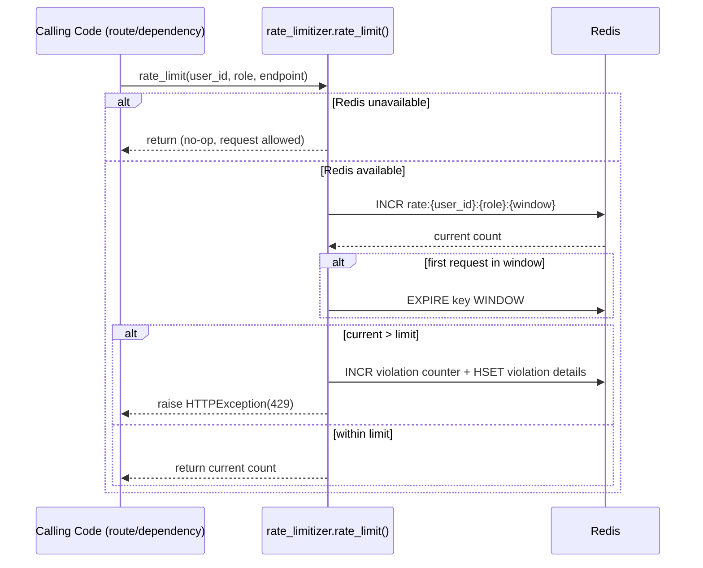
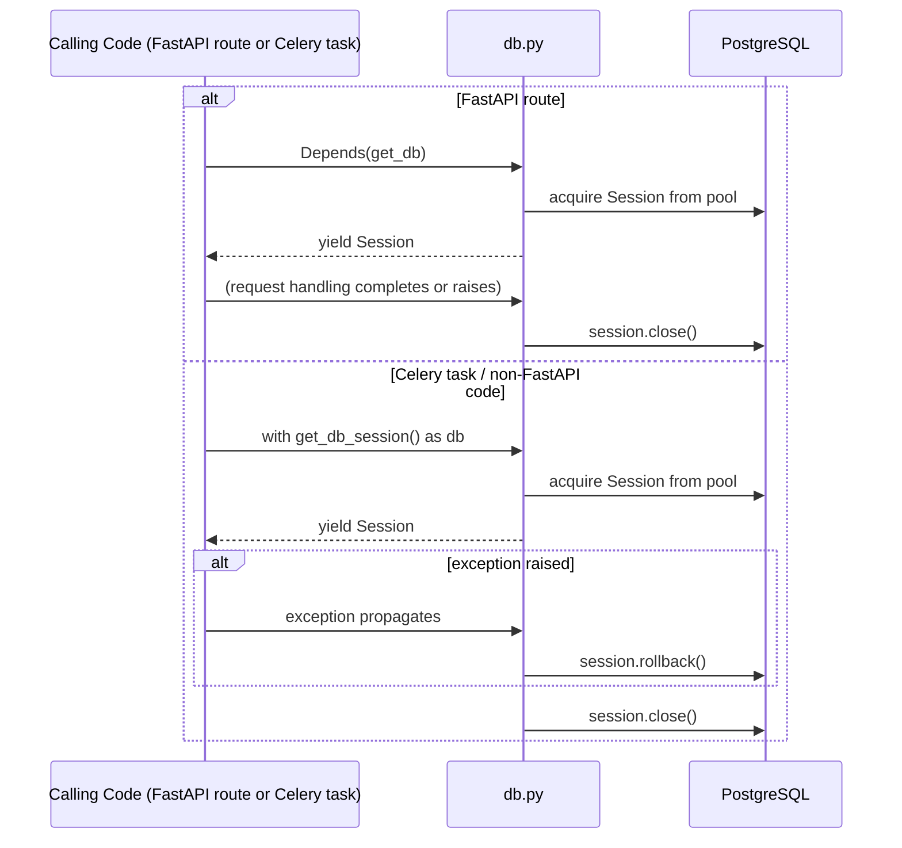

# Atlas AI — Core Infrastructure Module (`app/core`)

## Overview

This module provides shared infrastructure primitives used by the rest of the Atlas AI platform. Based strictly on the five files provided, it implements:

- **Configuration** (`config.py`) — centralized, environment-driven settings via Pydantic.
- **Database access** (`db.py`) — SQLAlchemy engine/session management for PostgreSQL.
- **Prometheus metrics** (`metrics.py`, `monitors.py`) — RAG-specific and platform-wide observability instrumentation.
- **Rate limiting** (`rate_limitizer.py`) — Redis-backed, role-based and IP-based request throttling.

No Agent Graph, RAG pipeline, retriever, memory system, LLM integration, prompting logic, vector database client, Celery task definitions, API route handlers, or authentication/JWT implementation were included in the provided files. These are **Referenced but not provided** (e.g., `settings.groq_api_key`, `settings.jina_api_key`, `settings.qdrant_url`, `settings.api_secret_key` imply the existence of LLM, embedding, and vector-DB integrations elsewhere in the codebase, and `internal_metrics_api_key` implies a Celery → FastAPI metrics-push mechanism), but their implementations are outside the scope of what was analyzed here. This README documents only `app/core`.

## Responsibilities

- Load and validate application configuration from environment variables / `.env`, failing fast if required secrets are missing.
- Provide a SQLAlchemy engine, session factory, and two session-acquisition patterns (FastAPI dependency and context manager) for PostgreSQL access.
- Define and expose Prometheus `Counter`/`Histogram`/`Gauge` metrics covering HTTP requests, RAG pipeline stages, agent execution, LLM usage/cost, authentication, database, cache, system resources, Celery tasks, errors, and evaluation runs.
- Provide helper functions/context managers to record those metrics from calling code.
- Enforce Redis-backed rate limiting per authenticated user (by role) and per client IP (for unauthenticated endpoints like login/register), with graceful degradation when Redis is unavailable.

## Boundaries

- This module does **not** implement business logic (retrieval, generation, agent reasoning). It is a dependency **for** those modules.
- It does not define the Prometheus HTTP exposition endpoint, Grafana dashboards, or a middleware that automatically calls `record_resource_metrics()` / increments the HTTP counters — none of that wiring is present in the provided files (`monitors.py`'s docstring mentions "Middleware integration for automatic request tracking," but no middleware code was supplied).
- It does not define the FastAPI app, routers, or authentication dependency (`Depends(...)`) that would call `rate_limit()` — only the rate-limiting function itself is provided.

## Project Structure

```
app/core/
├── config.py           # Settings (Pydantic BaseSettings), env-driven, fail-fast validation
├── db.py                # SQLAlchemy engine, session factory, get_db(), get_db_session()
├── metrics.py            # RAGMetrics: RAG-specific Prometheus metrics
├── monitors.py           # Platform-wide Prometheus metrics + helper trackers
├── rate_limitizer.py     # Redis-backed rate limiting (role-based + IP-based)
└── README.md             # (pre-existing documentation file, not analyzed as source code)
```

> Note: A `README.md` already existed in the provided archive alongside these files. This document is a fresh, independently generated README per the current request and does not assume the prior file's content is authoritative.

---

## How It Works

There is no single "request lifecycle" implemented within `app/core` itself — this module is a set of shared utilities imported by other layers (API routes, Celery tasks, agent/RAG code) that were not provided. The sections below describe what each file does and how a caller is expected to use it, based strictly on the provided implementations.

---

## File-by-File Explanation

### `config.py`

**Responsibility:** Single source of truth for all environment-driven configuration, using `pydantic_settings.BaseSettings`.

**Important Components:**
- `Settings` class with typed fields grouped by concern: PostgreSQL, JWT auth, external APIs (HuggingFace, Groq, Jina, a "remote embed" URL), internal service-to-service metrics auth, Redis, RAG pipeline timeouts, Qdrant, and SMTP/email.
- Two fields are declared **without defaults** and are therefore required: `postgres_pass` and `api_secret_key`. (Note: `postgres_pass` does have a literal default `"1234"` in the field declaration, but the docstring and validator both treat it as required — see "Known Limitations" below regarding this inconsistency.)
- `_check_required_secrets` — a `@model_validator(mode="after")` that raises `ValueError` at import time if `postgres_pass` or `api_secret_key` evaluate as falsy, preventing the app from starting with missing credentials.
- Computed properties: `DATABASE_URL` (builds a `postgresql+psycopg2://` connection string), `REDIS_URL` (includes password if set), `REDIS_URL_NO_DB` ("Redis URL without database number (for semantic cache)").
- `Config.env_file = ".env"`, `Config.extra = "ignore"` — extra environment variables are silently ignored rather than raising errors.
- Module-level singleton: `settings = Settings()`, instantiated at import time.

**Dependencies:** `pydantic.model_validator`, `pydantic_settings.BaseSettings`.

**Interactions:** Imported by `db.py` (for `DATABASE_URL`) and `rate_limitizer.py` (for Redis connection parameters). Fields such as `qdrant_url`, `groq_api_key`, `jina_api_key`, `semantic_memory_collection`, `sparse_embedding_model`, and `cross_encoder_model` strongly imply this `settings` object is also consumed by RAG/retrieval/embedding code not included in this analysis.

### `db.py`

**Responsibility:** SQLAlchemy engine and session lifecycle management for PostgreSQL.

**Important Components:**
- `data_base` — a SQLAlchemy engine created from `settings.DATABASE_URL` with `pool_size=20`, `max_overflow=10`, `pool_recycle=1800` (30 min), `pool_pre_ping=True` (validates connections before use, avoiding stale-connection errors).
- `Sessions` — a `sessionmaker` bound to `data_base` with `autoflush=False`, `autocommit=False`.
- `get_db()` — a generator-based FastAPI dependency: yields a `Session`, and closes it in a `finally` block regardless of exceptions. Does **not** call `rollback()` on exception (see Error Handling).
- `get_db_session()` — a `@contextmanager` for non-FastAPI callers (explicitly documented for Celery tasks). Unlike `get_db()`, it **does** call `db.rollback()` on exception before closing, and re-raises. The docstring notes this was a fix for a prior connection-leak bug where callers had to close sessions manually.

**Dependencies:** `sqlalchemy.create_engine`, `sqlalchemy.orm.sessionmaker`/`Session`, `app.core.config.settings`.

**Interactions:** `get_db()` is designed to be used with FastAPI's `Depends(get_db)` in route handlers (not provided). `get_db_session()` is designed for Celery tasks and other non-FastAPI code (Celery task definitions not provided).

### `metrics.py`

**Responsibility:** Defines RAG-pipeline-specific Prometheus metrics, described in the docstring as complementary to the system-wide metrics in `monitors.py`.

**Important Components:**
- `RAGMetrics` class (not instantiated — metrics are class attributes, used directly via `RAGMetrics.METRIC_NAME`):
  - `TOKEN_USAGE_COUNTER` — `Counter` labeled `[model_name, token_type, tenant_id]`.
  - `RAG_LATENCY_HISTOGRAM` — `Histogram` labeled `[step, tenant_id]`.
  - `CACHE_HIT_COUNTER` — `Counter` labeled `[status, tenant_id]`.
  - `REQUEST_COUNT` — `Counter` labeled `[tenant_id, status]`.

**Dependencies:** `prometheus_client.Counter`, `prometheus_client.Histogram`.

**Interactions:** No code in the provided files calls or increments these metrics — they are defined but their call sites (presumably in RAG/retrieval code) are **not provided**.

### `monitors.py`

**Responsibility:** The platform-wide Prometheus metrics registry plus a handful of helper functions/classes to record system resource usage and specific event types.

**Important Components (by category):**
- **HTTP metrics:** `http_requests_total`, `http_request_duration_seconds`, `http_request_size_bytes`, `http_response_size_bytes`.
- **RAG pipeline metrics:** document ingestion (`documents_ingested_total`, `document_ingestion_duration_seconds`, `document_chunks_created`, `duplicate_documents_detected`), embeddings (`embeddings_generated_total`, `embedding_generation_duration_seconds`, `embedding_batch_size`), retrieval (`vector_search_queries_total`, `vector_search_duration_seconds`, `retrieved_chunks_count`, `retrieval_precision_metric`, `retrieval_recall_metric`), reranking (`reranking_queries_total`, `reranking_duration_seconds`, `reranking_score_histogram`).
- **Agent metrics:** `agent_queries_total`, `agent_reasoning_steps_total`, `agent_decision_duration_seconds`, `agent_tool_calls_total`, `agent_reasoning_steps_count`, `agent_reasoning_duration_seconds`.
- **LLM/generation metrics:** `llm_queries_total`, `llm_query_duration_seconds`, `llm_tokens_generated`, `llm_tokens_consumed`, `llm_response_quality_score`, `query_pipeline_duration_seconds`.
- **Auth/security metrics:** `authentication_attempts_total`, `authentication_duration_seconds`, `active_user_sessions`, `invalid_token_attempts`.
- **Cost/billing metrics:** `api_calls_cost_total`, `tokens_cost_total`, `cost_per_query`, `tenant_monthly_cost`.
- **Database metrics:** `database_connection_pool_size`, `database_query_duration_seconds`, `database_errors_total`, `active_database_connections`.
- **Cache metrics:** `cache_hits_total`, `cache_misses_total`, `cache_size_bytes`.
- **System resource metrics:** `system_cpu_usage_percent`, `system_memory_usage_percent`, `system_disk_usage_percent`, `process_cpu_usage_percent`, `process_memory_usage_mb`, `process_open_file_descriptors`, `network_io_bytes_sent`, `network_io_bytes_received`.
- **Celery metrics:** `celery_task_total`, `celery_task_duration_seconds`, `celery_task_queue_size`, `celery_active_tasks`.
- **Error metrics:** `application_errors_total`, `exception_count`.
- **Evaluation metrics:** `evaluation_runs_total`, `evaluation_score`, `evaluation_duration_seconds`.
- **Helper functions:**
  - `record_resource_metrics()` — reads CPU/memory/disk via `psutil` and sets the corresponding gauges; wraps everything in a `try/except` that logs on failure (never raises).
  - `MetricsContext` — a context manager that times a block and calls `.observe(duration)` on a given histogram metric (with optional labels) on exit.
  - `track_llm_cost(tenant_id, model_name, input_tokens, output_tokens, cost)` — increments token and cost counters/histograms in one call.
  - `track_retrieval_metrics(tenant_id, chunks_retrieved, duration, precision=None, recall=None)` — increments retrieval counters/histograms; precision/recall gauges are only set if explicitly passed.
  - `track_agent_execution(tenant_id, agent_type, steps, duration, success)` — increments agent counters; notably, `agent_decision_duration_seconds` is only observed **if `success` is `True`** (failed executions do not record decision duration).
  - `track_authentication(success, duration)` — increments the auth counter with a `status` label derived from `success`, and observes duration unconditionally.

**Dependencies:** `prometheus_client`, `psutil`, `logging`, `time`.

**Interactions:** Like `metrics.py`, the ~50 metric objects here are defined but not called from any other provided file. `record_resource_metrics()` and the `track_*` helpers are the only code in this module that would be invoked by external callers — those call sites are not provided. The module docstring (including Arabic commentary) frames the intent as answering operational questions such as which endpoint is slow, which tenant consumes the most resources, LLM cost, retrieval time, cache effectiveness, and Celery queue health, but no middleware or scheduler that actually populates these metrics automatically was supplied.

### `rate_limitizer.py`

**Responsibility:** Redis-backed rate limiting with two distinct mechanisms — per-user (role-based) and per-IP (for sensitive unauthenticated endpoints).

**Important Components:**
- Module-level Redis client initialization: connects using `settings.redis_host/port/password/db`, `decode_responses=True`, `socket_connect_timeout=2`, and calls `.ping()` to verify connectivity at import time. If connection fails (`ConnectionError`, `TimeoutError`, `ResponseError`), `redis_client` is set to `None` and a warning is logged — the module **does not crash the app** if Redis is unreachable at startup.
- `RATE_LIMITS` dict: `{"admin": 300, "user": 100, "guest": 20}` requests per `WINDOW`.
- `AUTH_RATE_LIMITS` dict: `{"login": 10, "register": 5}` requests per `WINDOW`, keyed by client IP rather than user ID.
- `WINDOW = 60` seconds — a fixed-window rate limiting scheme (not sliding window / token bucket).
- `rate_limit(user_id, role="user", endpoint="unknown")`:
  - Returns immediately (no-op, allows the request) if `redis_client is None`.
  - Builds a key `rate:{user_id}:{role}:{now // WINDOW}` and does an atomic `INCR`; sets `EXPIRE` only on the first increment in that window (`current == 1`).
  - If `current > limit`, logs a violation (via `_log_rate_limit_violation`) and raises `HTTPException(429)`.
  - Otherwise returns the current count.
  - Catches `redis.ConnectionError`/`redis.TimeoutError` around the Redis calls and logs them, effectively **failing open** (allowing the request) rather than blocking it if Redis becomes unavailable mid-request. Note: this except block does not `return` explicitly after logging, so the function falls through to implicit `None` — the request is allowed.
- `_log_rate_limit_violation(...)`: increments a `violation:{user_id}:{window}` counter with a 5-window expiry, logs a warning, and stores full violation details (user_id, role, endpoint, current_count, limit, timestamp) in a Redis hash keyed `violation_details:{user_id}:{window}` via `HSET` with all values coerced to strings.
- `get_rate_limit_remaining(user_id, role="user")`: reads the current counter (without incrementing) and returns `limit - current`, clamped at 0. Returns `-1` if Redis is unavailable (interpreted as "unlimited").
- `reset_rate_limit(user_id, role="user")`: deletes the current-window key for that user/role. Returns `False` on any exception or if Redis is unavailable.
- `ip_rate_limit(client_ip, endpoint="unknown")`: same fixed-window `INCR`/`EXPIRE` pattern as `rate_limit`, but keyed by `ip_rate:{client_ip}:{endpoint}:{window}` and using `AUTH_RATE_LIMITS` (defaulting to the `login` limit if the endpoint isn't found). Raises `HTTPException(429)` on violation; logs and fails open on Redis connection/timeout errors, and also catches a bare `Exception` (broader than `rate_limit`'s error handling).

**Dependencies:** `redis`, `fastapi.HTTPException`/`status`, `app.core.config.settings`, `time`, `logging`.

**Interactions:** Designed to be called from FastAPI route handlers or dependencies (not provided) — e.g., `rate_limit(user_id, role, endpoint)` after authentication resolves a user's identity and role, or `ip_rate_limit(client_ip, "login")` before processing a login attempt. No such call sites were included in the provided code.

---

## Agent / RAG / Memory / Tools

**Not enough information from the provided code.** No Agent Graph, LangGraph nodes/edges, retriever, reranker, vector store client, prompt templates, or memory read/write logic were included in the five files analyzed. `config.py` and `metrics.py`/`monitors.py` contain strong evidence these systems exist elsewhere (e.g. `qdrant_collection_name`, `semantic_memory_collection`, `episodic_memory_ttl_days`, `cross_encoder_model`, and the full set of RAG/agent Prometheus metrics), but their implementations are outside this module's scope.

## Caching

**Partially implemented / Configuration-dependent.** `config.py` defines `REDIS_URL_NO_DB` explicitly commented "for semantic cache," and `metrics.py` defines `CACHE_HIT_COUNTER`, and `monitors.py` defines `cache_hits_total`/`cache_misses_total`/`cache_size_bytes`. However, no cache read/write/invalidation logic (semantic or exact-match) is present in the provided files — only the configuration surface and metric definitions exist. The only concrete Redis *usage* implemented here is the rate limiter's counters, which is not a content cache.

## Multi-Tenancy

**Referenced but not provided (mechanism), evidenced in metrics only.** Nearly every metric in `monitors.py` and `metrics.py` is labeled with `tenant_id` (e.g. `documents_ingested_total`, `llm_queries_total`, `atlas_agent_queries_total`, `active_user_sessions`), which shows the platform is tenant-aware and expects a `tenant_id` to be threaded through calls to these tracking functions. However:
- No tenant identification, extraction, or propagation logic is present in the provided files.
- No database-level or vector-store-level tenant filtering is implemented here.
- The rate limiter operates on `user_id` and `role`, not `tenant_id` — tenant-level rate limiting is not implemented in `rate_limitizer.py`.
- `db.py`'s engine/session objects are global and not tenant-scoped; any tenant isolation at the query level would need to be enforced by calling code (not provided).

**Conclusion:** Do not assume tenant isolation is enforced by this module. It only provides the *labels* to record tenant-scoped metrics; enforcement must live elsewhere.

## Data Flow

No request/state objects (Pydantic models, TypedDicts, dataclasses) are defined in the provided files. The closest thing to a data structure is the `Settings` object (`config.py`), which is a static configuration object, not a per-request state object.

```text
Settings (env vars / .env)
   ↓
settings singleton
   ↓
 ├─→ db.py: DATABASE_URL → SQLAlchemy engine → Session (per request/task)
 └─→ rate_limitizer.py: redis_host/port/password/db → redis.Redis client
```

## External Dependencies

| Dependency | Purpose | Where Used | Required? |
|---|---|---|---|
| PostgreSQL | Primary relational datastore | `db.py` (engine, sessions) | Required — `postgres_pass` has no valid default per the fail-fast validator |
| Redis | Rate-limit counters/violation logs; also referenced for STM (`stm_ttl_seconds`) and semantic cache URL in config | `rate_limitizer.py` (direct usage); `config.py` (`REDIS_URL`, `REDIS_URL_NO_DB`) | Optional at runtime for rate limiting — module degrades to "rate limiting disabled" if Redis is unreachable; other Redis-dependent features (STM, cache) are Referenced but not provided |
| Prometheus (`prometheus_client`) | Metrics collection (Counter/Histogram/Gauge) | `metrics.py`, `monitors.py` | Required for these modules to import successfully; no exposition/scrape endpoint provided |
| `psutil` | System/process resource stats | `monitors.py` (`record_resource_metrics`) | Required for that function; rest of module unaffected if unused |
| Qdrant | Vector database (config only) | `config.py` (`qdrant_url`, `qdrant_collection_name`, etc.) | Not enough information — no client code provided |
| Groq / HuggingFace / Jina APIs | LLM / embedding providers (config only) | `config.py` (`groq_api_key`, `hf_api`, `jina_api_key`, `remote_embed_url`) | Not enough information — no client code provided |
| SMTP | Email sending (config only) | `config.py` (`smtp_*`, `email_from`, `frontend_url`) | Not enough information — no email-sending code provided |
| Celery | Background task processing | Implied by `db.get_db_session()` docstring and `internal_metrics_api_key` / Celery metrics in `monitors.py` | Not enough information — no task definitions provided |

## Configuration

All configuration is defined in `config.py` via the `Settings` class, loaded from environment variables or a `.env` file (`extra = "ignore"` means unrecognized variables are silently dropped, not errors).

```env
# PostgreSQL
POSTGRES_USER=postgres
POSTGRES_PASS=<your-postgres-password>      # REQUIRED (validated at startup)
POSTGRES_HOST=localhost
POSTGRES_PORT=5432
POSTGRES_DB=<your-database-name>

# JWT / API auth
API_SECRET_KEY=<your-api-secret-key>        # REQUIRED (validated at startup)

# External APIs
HF_API=<your-huggingface-key>
GROQ_API_KEY=<your-groq-api-key>
JINA_API_KEY=<your-jina-api-key>
REMOTE_EMBED_URL=<remote-embedding-service-url>

# Internal service-to-service auth (Celery -> FastAPI metrics)
INTERNAL_METRICS_API_KEY=<internal-metrics-key>

# Redis
REDIS_HOST=localhost
REDIS_PORT=6379
REDIS_PASSWORD=<your-redis-password>
REDIS_DB=0
STM_TTL_SECONDS=7200
STM_MAX_TURNS=20

# RAG pipeline timeouts
SEMANTIC_CHUNKING_TIMEOUT=900
EMBEDDING_REQUEST_TIMEOUT=120.0

# Qdrant
QDRANT_URL=http://localhost:6333
QDRANT_COLLECTION_NAME=atlas_documents1
SEMANTIC_MEMORY_COLLECTION=atlas_semantic_memory
SEMANTIC_MEMORY_TOP_K=5
EPISODIC_MEMORY_TTL_DAYS=90
EPISODIC_MEMORY_RECENT_LIMIT=3
SEMANTIC_MEMORY_PRUNE_IMPORTANCE_BELOW=0.15
LLM_CONTEXT_WINDOW_TOKENS=8000
SPARSE_EMBEDDING_MODEL=Qdrant/bm25
CROSS_ENCODER_MODEL=cross-encoder/ms-marco-MiniLM-L-12-v2

# SMTP / Email
SMTP_SERVER=smtp.gmail.com
SMTP_PORT=587
SMTP_USERNAME=<your-smtp-username>
SMTP_PASSWORD=<your-smtp-password>
EMAIL_FROM=<sender-email-address>
FRONTEND_URL=http://localhost:3000
```

**Startup validation:** the app will refuse to start (raises `ValueError` during `Settings()` instantiation) if `POSTGRES_PASS` or `API_SECRET_KEY` are unset/empty.

## API Reference

**Not enough information from the provided code.** No API route/endpoint definitions (FastAPI routers, path operations) were included in the provided files.

## Error Handling

| Component | Failure | Behavior |
|---|---|---|
| `config.py` | `POSTGRES_PASS` or `API_SECRET_KEY` missing | Raises `ValueError` at import/instantiation time, halting startup |
| `db.py` (`get_db`) | Exception during request handling | Session is closed in `finally`; **no explicit rollback** is performed before close |
| `db.py` (`get_db_session`) | Exception during Celery/non-FastAPI usage | Session is rolled back (`db.rollback()`), then closed, then the exception is re-raised |
| `rate_limitizer.py` (Redis init) | Redis unreachable at import time | Caught (`ConnectionError`, `TimeoutError`, `ResponseError`); `redis_client` set to `None`; warning logged; module continues to import successfully |
| `rate_limitizer.py` (`rate_limit`) | `redis_client is None` | Function returns immediately — rate limiting is skipped (fails open) |
| `rate_limitizer.py` (`rate_limit`) | `redis.ConnectionError`/`TimeoutError` during a call | Caught and logged; function falls through without raising — request is allowed (fails open) |
| `rate_limitizer.py` (`rate_limit`) | Count exceeds limit | Raises `HTTPException(429)` with a descriptive message |
| `rate_limitizer.py` (`ip_rate_limit`) | Redis errors or any other `Exception` | Caught and logged (broader `except Exception` clause than `rate_limit`); fails open |
| `rate_limitizer.py` (`_log_rate_limit_violation`) | Any exception while logging/storing violation details | Caught and logged; does not propagate (violation logging failure never blocks the original rate-limit response) |
| `monitors.py` (`record_resource_metrics`) | Any exception (e.g. `psutil` failure) | Caught and logged; function does not raise |

## Async / Background Processing

**Partially implemented / referenced, not defined here.** No `async def`, `asyncio`, or Celery task decorators (`@app.task`, etc.) appear in the provided files. However:
- `db.get_db_session()` is explicitly documented as intended for use in Celery tasks.
- `config.py` defines `internal_metrics_api_key`, described as being for "Celery → FastAPI metrics," implying a background worker pushes metrics to the API via an internal authenticated call.
- `monitors.py` defines Celery-specific metrics (`celery_task_total`, `celery_task_duration_seconds`, `celery_task_queue_size`, `celery_active_tasks`) but no code that populates them.

The actual Celery app, task definitions, queues, and retry policies are **not provided**.

## Observability

- **Metrics framework:** Prometheus, via `prometheus_client` (`Counter`, `Histogram`, `Gauge`).
- **What is defined:** ~50+ metrics spanning HTTP, RAG stages (ingestion, embedding, retrieval, reranking), agents, LLM usage/cost, auth, database, cache, system resources, Celery, errors, and evaluation.
- **What is implemented (actually invoked) in the provided code:**
  - `record_resource_metrics()` — populates CPU/memory/disk/process gauges by directly querying `psutil`, on demand (not on a schedule — no scheduler is provided).
  - `MetricsContext` — a reusable timing context manager for any histogram.
  - `track_llm_cost`, `track_retrieval_metrics`, `track_agent_execution`, `track_authentication` — convenience wrappers that update several related metrics per call.
- **What is not implemented:** a Prometheus HTTP exposition endpoint (`/metrics`), any middleware that automatically times/counts HTTP requests, and any scheduler that periodically calls `record_resource_metrics()`. The RAG-specific metrics in `metrics.py` (`RAGMetrics`) have no corresponding tracking helper functions or call sites in the provided code.
- **Logging:** Standard library `logging` is used throughout (`config.py` has none directly, but `rate_limitizer.py` and `monitors.py` use `logger.warning`/`logger.error`/`logger.info`). No structured logging, request-ID propagation, or distributed tracing is present.

## Security

- **Secrets management:** `config.py` enforces at startup that `POSTGRES_PASS` and `API_SECRET_KEY` are set (fail-fast). Other sensitive fields (`redis_password`, `groq_api_key`, `jina_api_key`, `smtp_password`, `internal_metrics_api_key`) default to empty strings and are only "recommended," per the class docstring — the code does not enforce or warn about these at runtime beyond the docstring comment (no corresponding warning logic was found in the validator).
- **Authentication:** No JWT creation/validation, password hashing, or login-handling code is present in the provided files, despite `api_secret_key` clearly being intended for this purpose. **Not enough information from the provided code.**
- **Authorization / RBAC:** The rate limiter differentiates behavior by `role` string (`"admin"`, `"user"`, `"guest"`), which is a form of role-awareness, but there is no role-checking/permission-enforcement logic (e.g., blocking a `"guest"` from an admin-only action) — `rate_limitizer.py` only adjusts *request-count thresholds* by role.
- **Tenant isolation:** Not implemented in this module (see "Multi-Tenancy" above).
- **Brute-force protection:** `ip_rate_limit()` provides IP-based throttling specifically for `login`/`register` endpoints, which is a genuine, implemented security control against credential-stuffing/brute-force at the rate-limiting layer.
- **Input validation:** Pydantic validates the *shape* of configuration values (types), but there is no validation logic shown for user-supplied request data (no request/response schemas were provided).
- **Prompt injection defenses:** Not applicable/not present — no prompt-construction code was provided in this module.
- **Secret exposure risk:** `config.py` contains a literal default password `"1234"` for `postgres_pass` in the field declaration itself, which is inconsistent with the class docstring and validator both treating it as required-with-no-default. This is a **real inconsistency in the code as provided** (see Known Limitations).

## Performance

### Implemented Optimizations
- SQLAlchemy connection pooling (`pool_size=20`, `max_overflow=10`) with `pool_pre_ping=True` to avoid using stale/dead connections, and `pool_recycle=1800` to proactively recycle connections.
- Redis-based rate limiting uses a single atomic `INCR` per request plus a conditional `EXPIRE`, which is O(1) and low-latency.
- Rate limiter fails open on Redis errors rather than blocking all traffic, prioritizing availability over strict enforcement during Redis outages.

### Potential Optimization Opportunities
- The fixed-window rate-limiting algorithm (`now // WINDOW`) allows burst traffic at window boundaries (up to ~2x the limit across a boundary); a sliding-window or token-bucket algorithm would smooth this, but this is a suggestion, not a current implementation.
- No batching is evident for metric recording (each `track_*` call performs multiple synchronous Prometheus client calls).
- `record_resource_metrics()` calls `psutil.cpu_percent(interval=0.1)` twice (once for system, once per-process), each blocking for 0.1s — if called on a hot path this would add ~0.2s of blocking latency, though no caller is provided so this cannot be confirmed as an actual bottleneck.

## Cost Considerations

No LLM or embedding calls exist in the provided files, so no cost is directly incurred by this module. `monitors.py`'s `track_llm_cost()` and the various `*_cost_total`/`cost_per_query`/`tenant_monthly_cost` metrics indicate the platform tracks LLM/embedding cost elsewhere and reports it through this module's metric objects, but the actual cost computation and the decision of when an LLM/embedding call occurs are **not provided**.

## Sequence Diagrams

Only two flows are concretely implemented in the provided code:





## End-to-End Example

Using only what is implemented in the provided files, a plausible (not directly observed) integration would be:

1. **User input** — Not provided (no route handler).
2. **Request validation** — Not provided.
3. **Authentication** — Not provided (no JWT verification code), though `api_secret_key` exists in config for this purpose.
4. **Rate limiting** — *Implemented*: calling code would call `rate_limit(user_id, role, "some_endpoint")`, which checks/increments the Redis counter and raises `HTTPException(429)` if exceeded.
5. **State creation** — Not provided.
6. **Database session** — *Implemented*: calling code would use `Depends(get_db)` (FastAPI) or `get_db_session()` (Celery) to obtain a `Session`.
7. **Memory retrieval / RAG retrieval / Agent reasoning / Tool execution / LLM generation** — Not provided.
8. **Metrics recording** — *Implemented*: calling code could wrap timed operations in `MetricsContext(some_histogram, labels=...)`, or call `track_llm_cost(...)`, `track_retrieval_metrics(...)`, `track_agent_execution(...)`, or `track_authentication(...)` directly.
9. **Final response** — Not provided.

## Design Decisions

- The implementation suggests connection pooling with `pool_pre_ping=True` and `pool_recycle=1800` is intended to handle long-lived connections in a containerized/cloud environment where idle connections can be silently dropped by the database or a network intermediary.
- The implementation suggests the two different `db` acquisition patterns (`get_db` vs `get_db_session`) exist because FastAPI's dependency-injection `finally`-only cleanup is sufficient within request/response cycles, whereas Celery tasks (which run outside that lifecycle and may raise more varied exceptions) need explicit rollback-then-close semantics — this is stated directly in `get_db_session`'s docstring as fixing a prior connection-leak bug.
- The implementation suggests Redis was chosen for rate limiting because of its atomic `INCR`/`EXPIRE` primitives, which give O(1), race-free fixed-window counting without needing a database round-trip.
- The implementation suggests rate limiting "fails open" (allows requests through) rather than "fails closed" (blocking all requests) when Redis is unavailable, prioritizing platform availability over strict throttling during a Redis outage — this is an explicit design trade-off visible in both `rate_limit` and `ip_rate_limit`.
- The implementation suggests the separate `ip_rate_limit` function (keyed by IP rather than user ID) exists specifically to mitigate credential-stuffing/brute-force attacks against `login`/`register`, where a user identity does not yet exist to key on.
- The implementation suggests the large, pre-declared set of Prometheus metrics in `monitors.py`/`metrics.py` reflects a deliberate observability-first design across the whole platform (RAG, agents, cost, auth, Celery), even though the call sites that populate most of these metrics live outside this module.

## Failure Scenarios

| Failure | Expected Behavior | Impact |
|---|---|---|
| PostgreSQL unavailable at startup | `create_engine()` does not itself connect eagerly (SQLAlchemy engines are lazy), so import likely succeeds; the first `Sessions()`/query would fail with a connection error | Not enough information — no explicit handling of DB connection failure is shown beyond `pool_pre_ping` retry-on-checkout behavior |
| PostgreSQL unavailable mid-request (`get_db`) | Session is closed in `finally`; no rollback is attempted since none was requested from a dead connection | Request-level failure surfaces to caller as an unhandled exception (no provided handling converts it to an HTTP error) |
| PostgreSQL unavailable mid-task (`get_db_session`) | `rollback()` is attempted, then `close()`, then exception re-raised | Caller (e.g., Celery task) must handle the re-raised exception; not provided |
| Redis unavailable at rate-limiter import | Client set to `None`; warning logged | All calls to `rate_limit`/`ip_rate_limit` become no-ops (rate limiting disabled); `get_rate_limit_remaining` returns `-1`; `reset_rate_limit` returns `False` |
| Redis becomes unavailable mid-request | `ConnectionError`/`TimeoutError` caught and logged | Request is allowed through (fails open) |
| Missing `POSTGRES_PASS` / `API_SECRET_KEY` env vars | `ValueError` raised during `Settings()` instantiation | Application fails to start entirely (not a runtime failure — a startup failure) |
| `psutil` call fails inside `record_resource_metrics` | Exception caught and logged | Gauges simply are not updated for that call; no crash |

## Testing

No tests were provided in the analyzed code.

## Deployment

No deployment configuration (Dockerfile, docker-compose, Kubernetes manifests, startup commands, health-check endpoints) was provided in the analyzed code. The `.env`-based configuration in `config.py` and the connection-pool settings in `db.py` imply a containerized deployment target, but this is inference, not documentation of an actual deployment artifact.

## Known Limitations

### Confirmed Limitations
- `config.py` declares `postgres_pass: str = "1234"` as a literal default value in the field itself, while both the class docstring ("REQUIRED — no default") and the `_check_required_secrets` validator logic treat it as required. In practice, because a default value **is** present, `Settings()` will **not** raise even if `POSTGRES_PASS` is unset in the environment — it will silently use `"1234"`. The fail-fast check only triggers if the field is explicitly set to an empty string, which does not happen by default. This is a real gap between the documented intent and the actual code behavior.
- `get_db()` does not call `db.rollback()` on exception (unlike `get_db_session()`), so a failed transaction's changes may remain pending/uncommitted in a way that isn't explicitly cleaned up before the connection is returned to the pool (SQLAlchemy/psycopg2 will typically roll back an aborted transaction on connection return, but this is driver-level behavior, not something this code explicitly guarantees).
- The `rate_limit()` function's `except redis.ConnectionError`/`except redis.TimeoutError` blocks do not explicitly `return` after logging — they rely on implicit fall-through to `None`, which happens to produce the intended "fail open" behavior, but is easy to break if additional code is added after those except blocks in the future.
- Metrics defined in `metrics.py` (`RAGMetrics`) and the large majority of metrics in `monitors.py` have no producer code in the files provided — they are declarations only, from this module's perspective.

### Potential Risks / Improvements
- Fixed-window rate limiting can allow up to ~2x burst at window boundaries; consider a sliding-window algorithm if strict enforcement matters.
- Rate limiting is scoped to `user_id`/`role` and `client_ip`, not `tenant_id` — a single tenant with many users could still exceed intended tenant-level throughput even with per-user limits in place. This is a potential gap given how tenant-centric the rest of the platform's metrics are.
- No apparent mechanism ties Prometheus metric recording to actual request/response middleware — without that wiring (not provided), the HTTP-level metrics (`http_requests_total`, etc.) will remain at zero in practice.
- Storing violation details via `HSET` with all-string coercion (`{str(k): str(v) ...}`) means numeric fields (e.g. `current_count`, `limit`, `timestamp`) are stored as strings, which downstream analytics code would need to cast back to numbers.

## Future Improvements

Not stated in the provided code — no roadmap, TODO comments, or planning documents were included. Any future-improvement suggestions beyond the "Potential Risks / Improvements" above would be speculation, not analysis of the code.

## Summary

The provided files constitute a narrow but functional **core infrastructure slice** of Atlas AI: environment configuration with fail-fast secret validation, pooled PostgreSQL access via two session-acquisition patterns, an extensive Prometheus metrics vocabulary spanning the entire platform (most of it not yet wired to producers within this module), and a Redis-backed rate limiter with role-based and IP-based variants that fails open under Redis outages. The surrounding systems it clearly supports — RAG retrieval, agent reasoning, LLM generation, multi-tenant isolation, authentication, caching, and Celery background processing — are referenced throughout the configuration and metrics surfaces but were not included in the provided code and are therefore documented here only as inferred dependencies, not as implemented behavior.
