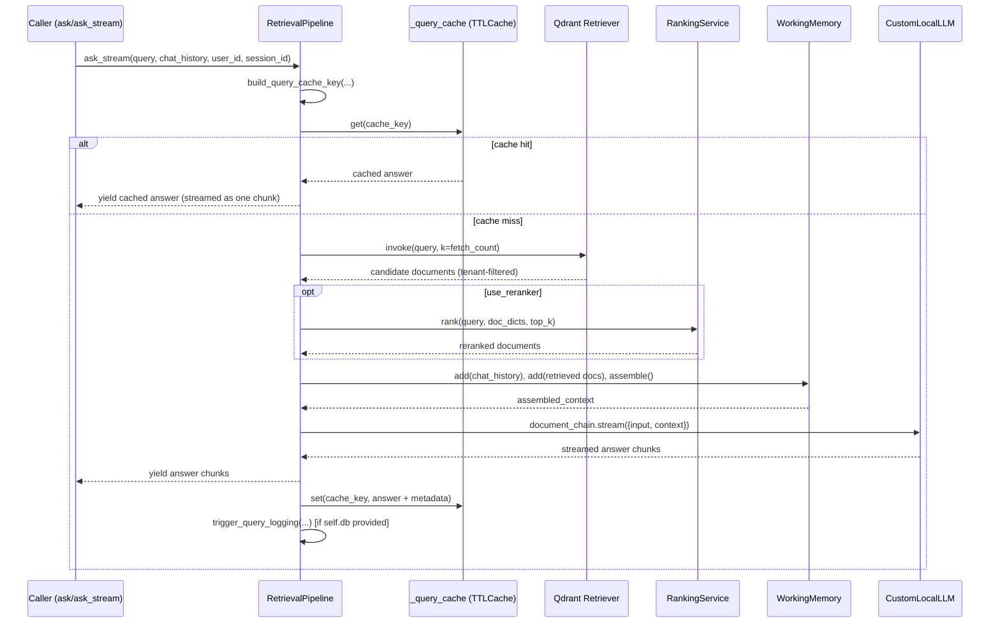

# Atlas AI — RAG Module

## Overview

This module (`app/rag`) implements a Retrieval-Augmented Generation (RAG) pipeline with two independent halves:

- **Ingestion** (`ingest_data_pipline.py`, `steps/ingest.py`, `steps/loader.py`, `steps/semantic_chunking_function.py`, `steps/file_tracker.py`) — turns an uploaded file into chunks and writes them into Qdrant.
- **Retrieval / Generation** (`retrivel_data_pipline.py`, `steps/retriever.py`, `reranker.py`, `rerankers/*`) — takes a user query, retrieves relevant chunks from Qdrant, optionally reranks them, assembles a context window, and streams an LLM-generated answer.

An `evaluation/` sub-package (`eval_pipline.py`, `relevance_evaluation.py`, `retrieval_stability.py`, `generate_eval_dataset.py`) provides offline tooling to score retrieval quality and generation quality against a JSON dataset.

> **Note on the bundled `rag/README.md`:** the repository already contains a `README.md` inside `app/rag`. It describes a **3-tier cache (RAM → Redis semantic cache → PostgreSQL)** with a 0.2 cosine-similarity threshold for semantic answer caching. Reading `retrivel_data_pipline.py`, **that description does not match the current implementation**. The code comments explicitly say the Redis semantic-cache behavior was a bug that has been removed ("Semantic retrieval is appropriate for documents and memories, but not for final answers: similar questions may have different answers.") The current implementation only has a single **exact-key, in-process `TTLCache`**. This document describes the code as it actually exists, and calls out this discrepancy again in [Known Limitations](#known-limitations).

---

## Responsibilities

- Load and chunk source documents, tag them with tenant metadata, and upsert them into a Qdrant hybrid (dense + sparse) collection.
- Track file-processing state (new / duplicate / processing / completed / failed) per tenant via a database-backed `FileTracker`.
- Given a query and a `tenant_id`, retrieve tenant-scoped documents from Qdrant, optionally rerank them, assemble a bounded context window, and stream an LLM answer.
- Cache exact repeated queries (same tenant + user + session + query + history) in-process to skip regeneration.
- Log run/cost/latency information for each answer (via a background logging call) — `Not enough information from the provided code` on the internals of that logger, since `query_logging_service.py` was not provided.
- Provide evaluation utilities to score precision/recall/MRR of retrieval and stability of retrieval across repeated/paraphrased queries.

## Boundaries / What Depends On It

- Depends on: `app.repositories.qdrant.QdrantRepository`, `app.repositories.trakcer_db_file_repositorie.TrackerDBFileRepository`, `app.repositories.cost_log_repository.CostLogRepository`, `app.repositories.runs_repository.RunsRepository`, `app.design_pattern.embedded_model.EmbeddedModel`, `app.memory.working_memory.WorkingMemory`, `app.services.llm_runner.CustomLocalLLM`, `app.services.rag_services.query_logging_service.trigger_query_logging`, `app.core.config.settings`, `app.core.monitors` (Prometheus metric objects). None of these files were provided, so their internals are `Not enough information from the provided code` — only what is inferable from how the RAG module calls them is documented below.
- Depended on by: `Not enough information from the provided code` — no API route files were provided. The bundled `rag/README.md` references `POST /api/ingest-rag/upload` and `POST /api/query/search`, but those route handlers are not in the provided files, so this cannot be confirmed against actual code — treat those endpoints as **Referenced but not provided**.

---

## Project Structure

```
app/rag/
├── README.md                          # Pre-existing docs (see discrepancy note above)
├── ingest_data_pipline.py             # RAGPipeline.process_file — top-level ingestion orchestration
├── retrivel_data_pipline.py           # RetrievalPipeline — retrieval + rerank + cache + LLM streaming
├── reranker.py                        # Re-exports rerankers package
│
├── rerankers/
│   ├── __init__.py                    # Re-exports
│   ├── base.py                        # Document, BaseReranker
│   ├── cross_encoder.py               # CrossEncoderReranker (sentence-transformers CrossEncoder)
│   ├── bm25.py                        # BM25Reranker (rank_bm25)
│   ├── hybrid.py                      # HybridReranker (blends cross-encoder + BM25)
│   └── service.py                     # RankingService (strategy dispatcher)
│
├── steps/
│   ├── loader.py                      # DocumentLoader — extension → LangChain loader map
│   ├── ingest.py                      # main() — chunk + insert into Qdrant
│   ├── semantic_chunking_function.py  # SemanticChunkingFunction — token + semantic chunking
│   ├── file_tracker.py                # FileTracker — hash-based dedup + status tracking
│   ├── retriever.py                   # get_retriever(tenant_id) — Qdrant hybrid retriever factory
│   └── embeddings.py                  # Module-level HuggingFaceEmbeddings instance (see note below)
│
├── data/
│   └── google.pdf                     # Sample/test document
│
└── evaluation/
    ├── eval_pipline.py                # EvalPipeline — end-to-end retrieval+generation scoring
    ├── relevance_evaluation.py        # precision / recall / F1 / MRR
    ├── retrieval_stability.py         # Jaccard-based repeat-run and paraphrase stability
    ├── generate_eval_dataset.py       # Scrolls Qdrant + LLM to auto-build evaluation_dataset.json
    └── evaluation_dataset.json        # Sample generated QA dataset (web-scraping/NLP domain)
```

`steps/embeddings.py` defines a module-level `HuggingFaceEmbeddings(model_name="BAAI/bge-m3")` instance, but it is **not imported anywhere else in the provided files**. `steps/retriever.py` and `steps/semantic_chunking_function.py` instead use `app.design_pattern.embedded_model.EmbeddedModel`, which was not provided. This file therefore appears to be **dead / superseded code** — `Not enough information` to say for certain since the rest of the codebase wasn't provided.

---

## How It Works — Request Lifecycle

### Ingestion flow (`RAGPipeline.process_file`)

```text
process_file(file_path, custom_metadata{tenant_id, source, author}, db)
    │
    ▼
FileTracker.calculate_file_hash(file_path)        # SHA-256 of file bytes
    │
    ▼
FileTracker.is_file_processed(tenant_id, hash, db) ──► True ──► return {"status": "skipped"}
    │ False
    ▼
FileTracker.mark_processing(tenant_id, file_name, hash, db)
    │
    ▼
DocumentLoader.load_file(file_path, custom_metadata)   # extension-based LangChain loader
    │  (on failure → FileTracker.mark_failed, return {"status": "failed", "stage": "loading"})
    │  (if empty    → FileTracker.mark_failed, return {"status": "failed", "stage": "validation"})
    ▼
full_text = "\n\n".join(page_content for all loaded pages)
    │
    ▼
steps.ingest.main(full_text, custom_metadata)
    │  (on failure → FileTracker.mark_failed, return {"status": "failed", "stage": "ingestion"})
    ▼
FileTracker.mark_completed(tenant_id, hash, db)
    │
    ▼
POST {API_HOST}/api/internal/metrics/record   # best-effort webhook, 2s timeout, exceptions swallowed
    │
    ▼
return {"status": "success", "message": "...", "details": result}
```

Inside `steps/ingest.py::main(text, my_metadata)`:

```text
main(text, my_metadata)
    │
    ▼
validate text is non-empty (raise ValueError otherwise)
    │
    ▼
QdrantRepository().create_collection(collection_name)   # idempotent create
    │
    ▼
SemanticChunkingFunction.process_document(text, my_metadata)
    │
    ▼
for each chunk: SemanticChunkingFunction.generate_chunk_id(page_content, tenant_id, source)
    │            → deterministic UUID from md5(f"{tenant_id}_{source}_{text}")
    ▼
repo.add_hybrid_documents(collection_name, data_to_insert)   # QdrantRepository, not provided
    │
    ▼
return {"status": "success", "chunks_created": N, "chunks_inserted": M, "collection": name}
```

`SemanticChunkingFunction.process_document` (in `steps/semantic_chunking_function.py`):

```text
1. RecursiveCharacterTextSplitter(chunk_size=2000, chunk_overlap=50).create_documents([text], [metadata])
2. if use_semantic_chunking is False OR only 1 initial chunk → return initial (token-based) chunks
3. else initialize EmbeddedModel()
     - on init failure → log + fall back to initial (token-based) chunks
4. Run SemanticChunker(embeddings=EmbeddedModel, breakpoint_threshold_type="percentile",
     breakpoint_threshold_amount=90).split_documents(initial_docs) in a daemon thread
     - timeout = settings.semantic_chunking_timeout (default 900s if settings attribute missing/raises)
     - if thread times out, raises internally, or returns None → fall back to initial token-based chunks
5. else return the semantically-split documents
```

### Retrieval / generation flow (`RetrievalPipeline`)

```text
RetrievalPipeline(tenant_id, use_reranker, reranker_strategy, db)
    │
    ├── self.retriever = get_retriever(tenant_id)          # steps/retriever.py, cached per tenant
    ├── self.ranking_service = _get_ranking_service(strategy) if use_reranker else None
    ├── self.local_llm = _cached_llm                        # module-level CustomLocalLLM() singleton
    └── self.qa_chain = create_retrieval_chain(retriever, create_stuff_documents_chain(local_llm, prompt))
                                                              # built but NOT used by ask()/ask_stream()

ask(query, chat_history, user_id, session_id, ...)  /  ask_stream(same args)
    │  (both are thin wrappers around the same generator, _stream_answer, with use_local_cache=True)
    ▼
cache_key = build_query_cache_key(tenant_id, query, chat_history, user_id, session_id)
    │        = f"{tenant_id}:{md5('tenant=...\\nuser=...\\nsession=...\\nquery=...\\nhistory=...')}"
    ▼
_query_cache (module-level, thread-safe TTLCache, maxsize=10_000, ttl=3600s)
    │
    ├── HIT  → yield cached["answer"]; log run with cache_hit=True, 0 tokens, model "... (CACHED)"; return
    │
    └── MISS → docs = self.retrieve(query)              # see retrieval sub-flow below
               │
               ▼
        WorkingMemory(settings.llm_context_window_tokens)
               .add("conversation context", chat_history, priority=2, max_tokens=1600)
               .add("retrieved documents", "\n\n".join(doc.page_content), priority=5, max_tokens=5600)
               .assemble()                                # WorkingMemory internals not provided
               │
               ▼
        self.document_chain.stream({"input": query, "context": [Document(assembled_context)]})
               │   (streams chunks; each non-empty string chunk is yielded to the caller)
               ▼
        cost = input_tokens * INPUT_TOKEN_COST + output_tokens * OUTPUT_TOKEN_COST
               (tokens read from CustomLocalLLM.last_usage, a class attribute)
               │
               ▼
        _set_cached(cache_key, {"answer", "docs_ids", "documents", "timestamp"})
               │
               ▼
        _log_run(...) → trigger_query_logging(tenant_id, query, answer, latency, cache_hit,
                          retrieved_docs_ids, input_tokens, output_tokens, model_name)
                          (best-effort; only called if self.db was supplied; exceptions are caught and logged)
```

`retrieve(query, top_k=10, fetch_multiplier=2)`:

```text
fetch_count = top_k * fetch_multiplier   if use_reranker else top_k
docs = self.retriever.invoke(query, k=fetch_count)
        │ (TypeError fallback: rebuild a fresh retriever via
        │  self.retriever.vectorstore.as_retriever(search_kwargs={..., "k": fetch_count})
        │  — the cached shared retriever instance itself is never mutated)
        ▼
record Prometheus metrics: vector_search_queries_total, vector_search_duration_seconds, retrieved_chunks_count
        ▼
docs = sorted(docs, key=lambda d: d.metadata.get("_id", ""))   # deterministic ordering for caching
        ▼
if use_reranker and ranking_service and docs:
        doc_dicts = [{"content", "metadata", "score": 1.0} for each doc]
        reranked = ranking_service.rank(query, doc_dicts, top_k=top_k)
        record Prometheus metrics: reranking_queries_total, reranking_duration_seconds
        docs = [Document(page_content, metadata={**original, original_score, rerank_score, combined_score})
                for doc in reranked]
        ▼
return docs[:top_k]
```

---

## RAG Pipeline

### Query Processing

- **Input normalization**: none beyond what the retriever/embedding model does internally. No query rewriting, expansion, or LLM-based reformulation is implemented in the provided files.
- **Tenant constraint**: enforced at retriever-construction time (see [Multi-Tenancy](#multi-tenancy)), not per-call.
- **User/session constraints**: not applied to retrieval itself — `user_id`/`session_id` are used only in the local answer-cache key, not as a Qdrant filter.

### Retrieval

- **Vector database**: Qdrant (`qdrant_client.QdrantClient`), collection name from `settings.qdrant_collection_name`.
- **Embeddings**: `langchain_qdrant.QdrantVectorStore` is configured with `vector_name="dense"` and `sparse_vector_name="sparse"`, `retrieval_mode=RetrievalMode.HYBRID`, using `app.design_pattern.embedded_model.EmbeddedModel` for dense vectors and `FastEmbedSparse(model_name=settings.sparse_embedding_model)` for sparse vectors. Both embedding classes' internals (dimensions, exact model IDs) were **not provided** — `Not enough information from the provided code` beyond the sparse model coming from `settings.sparse_embedding_model`.
- **Hybrid combination**: delegated entirely to `langchain_qdrant`'s `RetrievalMode.HYBRID`; the specific dense/sparse blending weights are internal to that library and not visible in this codebase. (The bundled `rag/README.md`'s `hybrid_score = 0.7*dense + 0.3*sparse` formula is **not present anywhere in the provided retrieval code** — it appears to describe the reranker weighting, not the vector search step; see next section.)
- **Filtering**: a Qdrant `Filter` with `FieldCondition(key="payload.tenant_id", match=MatchValue(value=tenant_id))` is baked into `search_kwargs` when the retriever is constructed.
- **Top-k**: `retrieve()` accepts `top_k` (default 10) and, when reranking is enabled, first fetches `top_k * fetch_multiplier` (default multiplier 2) candidates before reranking down to `top_k`.
- **Ordering**: post-fetch, documents are sorted by `metadata["_id"]` before optional reranking, to keep cache keys/results deterministic.

### Reranking

Reranking is **optional** (`use_reranker` flag) and, when enabled, dispatched by `RankingService(strategy)`:

| Strategy | Class | Behavior |
|---|---|---|
| `"cross-encoder"` | `CrossEncoderReranker` | Loads `sentence_transformers.CrossEncoder(model_name)` (`model_name` from `settings.cross_encoder_model`, or explicit constructor arg). Scores `(query, doc)` pairs and sorts descending. |
| `"bm25"` | `BM25Reranker` | Uses `rank_bm25.BM25Okapi` over `doc.content.lower().split()` tokens; scores query tokens against the corpus. |
| `"hybrid"` (default, also the fallback for unknown strategy strings) | `HybridReranker` | Runs both `CrossEncoderReranker` (default model `cross-encoder/ms-marco-MiniLM-L-12-v2`, **not** the `-L-6-v2` cited in the bundled README) and `BM25Reranker`, min-max normalizes both score arrays, then combines as `0.7 * ce_score_norm + 0.3 * bm25_score_norm` (weights configurable via constructor args `cross_encoder_weight`/`bm25_weight`). |

All three rerankers degrade gracefully: if the underlying library isn't installed, or an exception occurs during scoring, they log the error and return `documents[:top_k]` unranked rather than raising.

`RankingService.rank()` returns dicts with `original_score`, `rerank_score`, and `combined_score = (original_score + rerank_score) / 2` — note this `combined_score` is a **second**, separate averaging on top of whatever internal weighting the chosen reranker strategy already applied.

### Context Construction

- Handled by `app.memory.working_memory.WorkingMemory` (not provided — internals of `.add()`/`.assemble()` are `Not enough information from the provided code`).
- Observable contract from the call site: constructed with `settings.llm_context_window_tokens`; two prioritized additions — `"conversation context"` (priority 2, capped at 1600 tokens) and `"retrieved documents"` (priority 5, capped at 5600 tokens, joined from `doc.page_content` with `"\n\n"`) — then `.assemble()` returns a single string. Exposes `.tokens_used` and `.context_sources` attributes used for logging.
- Deduplication of overlapping/duplicate chunks: not visible in the provided RAG-module code (would have to happen inside `WorkingMemory`, not provided).

### Generation

- **LLM**: `app.services.llm_runner.CustomLocalLLM`, instantiated once at module import time as a singleton (`_cached_llm`). Internals (which model/provider it wraps, e.g. Qwen as suggested by the logged model name `"Qwen2.5-1.5B"`) are **not provided**.
- **Prompt**: a single `ChatPromptTemplate`:
  ```text
  Answer the following question based only on the assembled context:

  {context}

  Question: {input}

  Answer:
  ```
- **Context injection**: the assembled context string is wrapped in a single `langchain_core.documents.Document` and passed as `context` to `self.document_chain.stream(...)`.
- **Streaming**: `document_chain.stream()` yields chunk objects; both dict-shaped and plain-string chunks are handled, concatenated into `full_answer`, and yielded onward to the caller.
- **Structured output / temperature / other LLM parameters**: not configured in this module — `Not enough information from the provided code` (would live inside `CustomLocalLLM`, not provided).
- **Token accounting**: read from `CustomLocalLLM.last_usage` (a class attribute, not instance attribute) after streaming completes; `{"input": N, "output": M}` keys expected, defaulting to `0`.

### Complete RAG Flow (implementation-specific)



---

## Memory System

Only one memory-adjacent component is visible in the provided RAG-module files:

- **`WorkingMemory`** (`app.memory.working_memory`, imported but not provided) — used per-request to assemble a token-budgeted context string from chat history + retrieved documents. This is **request-scoped, in-memory, not persisted** as far as this module's usage shows.
- Code comments in `retrivel_data_pipline.py` reference "semantic memories" and "episodic memories" as user-scoped concepts that factor into the final answer cache key (`build_query_cache_key` includes `user_id` and `session_id` specifically because of this), but no semantic/episodic memory read or write calls exist inside the provided RAG files themselves — `Referenced but not provided`.
- **Tenant / user / session isolation for the answer cache**: enforced structurally, since `tenant_id`, `user_id`, and `session_id` are all concatenated into the string that is MD5-hashed to form the cache key (`build_query_cache_key`). Two requests differing in any of those fields produce different cache keys and therefore cannot read each other's cached answer.
- No TTL/eviction policy beyond the cache-wide `TTLCache(maxsize=10_000, ttl=3600)` — individual entries are not given per-tenant TTLs, and there's no explicit deletion API for a specific tenant/user's cached entries.

---

## Caching

There is exactly **one cache** implemented in the retrieval pipeline:

| Property | Value |
|---|---|
| Type | In-process `cachetools.TTLCache` (module-level, shared by all `RetrievalPipeline` instances in a process) |
| Key | `f"{tenant_id}:{md5(tenant=...⏎user=...⏎session=...⏎query=...⏎history=...)}"` — an **exact-match** key over tenant, user, session, query text, and chat history |
| Max size | 10,000 entries |
| TTL | 3600 seconds |
| Thread-safety | Guarded by a `threading.Lock()` around get/set |
| What's cached | `{"answer": str, "docs_ids": comma-joined doc IDs, "documents": serialized doc list, "timestamp": float}` |
| Cache hit behavior | Skips retrieval, reranking, context assembly, and the LLM call entirely — the cached answer is yielded directly and a "run" log entry is written with 0 input/output tokens and model name suffixed `"(CACHED)"` |
| Invalidation | Time-based only (TTL); no explicit invalidation on document re-ingestion, so a cached answer can go stale relative to newly-ingested tenant documents until the TTL expires |

There is **no semantic/similarity-based caching of final answers** in the code, despite the bundled `rag/README.md` describing one. In-line code comments explicitly disclaim this design ("Different questions always generate a fresh answer, even when their embeddings or document context overlap"). See [Known Limitations](#known-limitations).

Separately, `steps/retriever.py` maintains a `_retrievers_cache: dict[tenant_id, retriever]` module-level dict that caches the constructed `VectorStoreRetriever` object per tenant (not query results) so repeated calls for the same tenant reuse the same retriever/vectorstore wiring instead of rebuilding it.

---

## Multi-Tenancy

```text
Caller supplies tenant_id
        │
        ▼
RetrievalPipeline(tenant_id=...)
        │
        ▼
get_retriever(tenant_id)                       # steps/retriever.py
        │
        ├── cache hit  → return cached retriever for this tenant_id
        │
        └── cache miss → build QdrantVectorStore.as_retriever(
                             search_kwargs={"filter": Filter(must=[FieldCondition(
                                 key="payload.tenant_id", match=MatchValue(value=tenant_id))])})
                           cache it in _retrievers_cache[tenant_id]
        ▼
Every retriever.invoke(query, ...) call is scoped by this baked-in tenant filter,
so vector search results can only come from points whose payload.tenant_id matches.
```

- **Tenant identification**: passed explicitly as a constructor argument to `RetrievalPipeline`/`get_retriever`/`RAGPipeline.process_file` — `Not enough information` on how it's derived from an authenticated request, since no auth/API layer was provided.
- **Enforcement point**: the Qdrant `Filter` embedded in the retriever's `search_kwargs`. This is the only tenant boundary visible in the RAG module.
- **Ingestion-side isolation**: `custom_metadata["tenant_id"]` is required (`ingest_data_pipline.py` does `str(custom_metadata["tenant_id"])`, raising `KeyError` if absent) and is propagated into every chunk's metadata via `SemanticChunkingFunction.process_document(text, metadata)`, and into the deterministic chunk ID (`generate_chunk_id` hashes `tenant_id + source + text`), which also prevents cross-tenant ID collisions for identical text.
- **File-dedup isolation**: `FileTracker.is_file_processed(tenant_id, file_hash, db)` scopes duplicate-detection per tenant, so two tenants uploading byte-identical files are tracked independently (subject to `TrackerDBFileRepository`'s actual query, not provided).
- **Answer-cache isolation**: as described above, `tenant_id` is part of the cache key.
- **What is *not* verified in these files**: authentication/authorization that resolves a request to a `tenant_id` in the first place, and any check that a given `user_id` is actually a member of `tenant_id`. `Not implemented / not visible in the provided code`.

---

## Data Flow

```text
UserQuery (str) + tenant_id + chat_history + user_id + session_id
        ↓
cache_key (str, md5 hash)
        ↓  (on miss)
List[langchain_core.documents.Document]      ← retriever.invoke()
        ↓
List[langchain_core.documents.Document] (sorted by metadata["_id"])
        ↓  (if use_reranker)
List[Dict{content, metadata, score}]          ← converted for RankingService
        ↓
List[Dict{content, metadata, original_score, rerank_score, combined_score}]
        ↓
List[langchain_core.documents.Document] (metadata enriched with scores)
        ↓
assembled_context (str)                       ← WorkingMemory.assemble()
        ↓
document_chain.stream({"input", "context": [Document(assembled_context)]})
        ↓
full_answer (str), incrementally yielded chunks
        ↓
cache entry {"answer", "docs_ids", "documents", "timestamp"}  → written to TTLCache
        ↓
trigger_query_logging(...)                     ← async/background side effect (fire-and-forget from caller's perspective)
```

`Document` (rerankers, `rerankers/base.py`) is a small internal dataclass-like class distinct from `langchain_core.documents.Document`:

```python
class Document:
    content: str
    metadata: Dict
    score: float = 0.0
    rerank_score: float = 0.0   # set after reranking
```

---

## External Dependencies

| Dependency | Purpose | Where Used | Required? |
|---|---|---|---|
| Qdrant | Vector store for hybrid (dense+sparse) document search | `steps/retriever.py`, `steps/ingest.py` (via `QdrantRepository`), `evaluation/generate_eval_dataset.py` | Yes — retrieval and ingestion both fail without it |
| `langchain_qdrant` | Wraps Qdrant as a LangChain retriever, hybrid mode | `steps/retriever.py` | Yes |
| `FastEmbedSparse` | Sparse embedding generation for hybrid search | `steps/retriever.py` | Yes, for hybrid search |
| Sentence-Transformers `CrossEncoder` | Neural reranking | `rerankers/cross_encoder.py` | Only if `use_reranker=True` and strategy includes cross-encoder; degrades to pass-through if not installed |
| `rank_bm25` | Lexical reranking | `rerankers/bm25.py` | Only if `use_reranker=True` and strategy includes BM25; degrades to pass-through if not installed |
| `langchain_experimental.SemanticChunker` | Embedding-based semantic chunking | `steps/semantic_chunking_function.py` | No — falls back to token-based chunking on any failure/timeout |
| `langchain_text_splitters.RecursiveCharacterTextSplitter` | Baseline token-based chunking | `steps/semantic_chunking_function.py` | Yes (always runs first) |
| `EmbeddedModel` (internal, not provided) | Dense embeddings for retrieval + semantic chunking | `steps/retriever.py`, `steps/semantic_chunking_function.py`, `retrivel_data_pipline.py` | Yes |
| `CustomLocalLLM` (internal, not provided) | LLM used to generate answers | `retrivel_data_pipline.py`, `evaluation/generate_eval_dataset.py` | Yes |
| SQLAlchemy `Session` / PostgreSQL (implied) | File-processing tracking, run/cost logging | `steps/file_tracker.py`, `retrivel_data_pipline.py` (`RunsRepository`, `CostLogRepository`) | Optional for retrieval (only if `db` is passed to `RetrievalPipeline`); required for ingestion tracking |
| `cachetools` | In-process TTL cache for exact-match answer caching | `retrivel_data_pipline.py` | Yes, for the caching feature (module still works without a hit, cache just never populates on import failure — not proven, likely a hard import) |
| Prometheus client objects (`app.core.monitors`) | Metrics for vector search / reranking counts & durations | `retrivel_data_pipline.py` | Yes for observability; not provided in these files |
| `requests` | Fire-and-forget internal metrics webhook after ingestion | `ingest_data_pipline.py` | No — wrapped in try/except, failures are logged and swallowed |
| LangChain document loaders (`PyPDFLoader`, `UnstructuredWordDocumentLoader`, etc.) | Parsing uploaded files by extension | `steps/loader.py` | Yes, per file type being ingested |

---

## Configuration

Configuration is read from a single `app.core.config.settings` object (not provided). The following attributes are referenced by name in the RAG module:

```env
# Qdrant
QDRANT_URL=<your-qdrant-url>                      # settings.qdrant_url
QDRANT_COLLECTION_NAME=<your-collection-name>     # settings.qdrant_collection_name

# Embeddings
SPARSE_EMBEDDING_MODEL=<your-sparse-model-name>   # settings.sparse_embedding_model

# Reranking
CROSS_ENCODER_MODEL=<your-cross-encoder-model>    # settings.cross_encoder_model

# Chunking
SEMANTIC_CHUNKING_TIMEOUT=900                     # settings.semantic_chunking_timeout (falls back to 900 if missing/erroring)

# LLM context / cost
LLM_CONTEXT_WINDOW_TOKENS=<your-window-size>      # settings.llm_context_window_tokens
QWEN_INPUT_TOKEN_COST=0.0000001                   # settings.QWEN_INPUT_TOKEN_COST (falls back to 0.0000001 via getattr)
QWEN_OUTPUT_TOKEN_COST=0.0000002                  # settings.QWEN_OUTPUT_TOKEN_COST (falls back to 0.0000002 via getattr)

# Ingestion metrics webhook
API_HOST=http://localhost:8000                    # os.environ["API_HOST"], read directly (not via settings)
INTERNAL_METRICS_API_KEY=<your-internal-token>    # settings.internal_metrics_api_key (sent as X-Internal-Token header)
```

Notes:
- Everything except `API_HOST` is read via `settings.<attr>`; only `semantic_chunking_timeout` and the two `QWEN_*_TOKEN_COST` values have explicit code-level fallbacks (`getattr(settings, name, default)` or a try/except). All others will raise `AttributeError` at runtime if `settings` doesn't define them.
- `evaluation/generate_eval_dataset.py` independently reads `settings.qdrant_url` and `settings.qdrant_collection_name` to scroll Qdrant directly (bypassing the retriever/tenant-filter path used elsewhere — see [Known Limitations](#known-limitations)).
- No credentials for Qdrant auth (API key) are referenced anywhere in the provided code — `Not enough information from the provided code` on whether/how Qdrant auth is configured.

---

## Error Handling

| Stage | Behavior |
|---|---|
| File not found (hashing) | `FileTracker.calculate_file_hash` raises `FileNotFoundError`; not caught inside itself, propagates up to `process_file`'s outer `try/except`, which marks the file failed (`stage: "unknown"`) and returns a failure dict. |
| Document loading fails | Caught in `process_file`; marks file failed, returns `{"status": "failed", "stage": "loading", "error": ...}`. |
| Loaded document is empty | Explicit check; marks file failed, returns `{"status": "failed", "stage": "validation"}`. |
| Ingestion (`steps.ingest.main`) fails | Caught in `process_file` with full traceback logged; marks file failed, returns `{"status": "failed", "stage": "ingestion", "error": ...}`. |
| Empty text passed to `ingest.main` | Raises `ValueError("Cannot chunk empty text")` before touching Qdrant. |
| Chunking (`SemanticChunkingFunction.process_document`) produces nothing | `ingest.main` raises `ValueError("Chunking produced no chunks")`. |
| Per-chunk ID/prep error | Caught per-chunk inside `ingest.main`'s loop; that chunk is skipped and logged, other chunks continue. |
| No chunks survive prep | Raises `ValueError("No valid chunks to insert")`. |
| Qdrant insertion fails | Caught, logged with traceback, re-raised — surfaces as the "ingestion" failure stage above. |
| Metrics webhook fails/times out | Caught in its own `try/except` (2.0s timeout on the `requests.post` call); logged only, does **not** fail the overall ingestion result. |
| Any unexpected exception in `process_file` | Outer `try/except` catches everything, attempts `FileTracker.mark_failed` (itself wrapped in a nested `try/except` in case tracking also fails), returns `{"status": "failed", "stage": "unknown"}`. |
| Semantic chunking embedding-model init fails | Caught; logs and falls back to token-based chunks (ingestion continues, does not fail the run). |
| Semantic chunking times out (`threading.Thread.join(timeout)`) | If the thread is still alive after `timeout`, falls back to token-based chunks. Note: the background thread itself is **not killed** — it is a daemon thread and will continue running until the process exits or it finishes on its own. |
| Semantic chunking raises internally | Exception captured into `result_holder["error"]` inside the worker thread; logged, falls back to token-based chunks. |
| Retriever's `invoke(query, k=...)` raises `TypeError` | Caught; falls back to rebuilding a retriever with `k` set in `search_kwargs` via `vectorstore.as_retriever(...)`, without mutating the shared cached retriever. |
| Reranker load/predict failures (cross-encoder, BM25) | Each reranker catches its own exceptions internally and returns `documents[:top_k]` unranked rather than propagating. |
| Answer-cache logging (`trigger_query_logging`) fails | Caught in `_log_run`; logged only, does not interrupt the streamed answer already yielded to the caller. |
| LLM streaming itself | No explicit try/except around `self.document_chain.stream(...)` in `_stream_answer` — an exception here would propagate to the caller of `ask()`/`ask_stream()` uncaught. |

---

## Async / Background Processing

- **Semantic chunking timeout guard**: uses a `threading.Thread` (daemon) with `.join(timeout=...)` inside `SemanticChunkingFunction.process_document` — the only concurrency primitive used directly inside the RAG module's own code.
- **Answer generation is a Python generator** (`ask`, `ask_stream`, `_stream_answer` all `yield`), so the LLM call is streamed rather than blocking for the full response, but this is synchronous generator streaming, not `asyncio`.
- **Metrics webhook** in `process_file` is a synchronous `requests.post` call with a short (2.0s) timeout — this blocks `process_file` briefly but failure doesn't fail the overall ingestion.
- **Run/cost logging** (`trigger_query_logging`) is called synchronously from `_log_run`, but its own implementation (queue, Celery task, etc.) was **not provided** — the docstring/log message ("Queued background logging") suggests it enqueues work rather than doing it inline, but this cannot be confirmed from the given files. `Referenced but not provided`.
- No Celery, asyncio event loop, or task queue code is present anywhere in the provided RAG-module files.

---

## Observability

| Signal | Mechanism | Recorded where |
|---|---|---|
| Vector search query count | `vector_search_queries_total.labels(tenant_id=...).inc()` | `RetrievalPipeline.retrieve()`, every call |
| Vector search duration | `vector_search_duration_seconds.observe(retrieval_time)` | same |
| Retrieved chunk count | `retrieved_chunks_count.observe(len(docs))` | same |
| Reranking query count | `reranking_queries_total.labels(reranker_type=...).inc()` | `retrieve()`, only if `use_reranker` |
| Reranking duration | `reranking_duration_seconds.labels(reranker_type=...).observe(rerank_time)` | same |
| Cache hits | `cache_hits_total.labels(cache_type="local_memory").inc()` | `_stream_answer()`, only on a local cache hit |
| Structured logging | Standard `logging` module throughout (`logger.info/warning/error/debug`), including query previews (truncated to 50 chars), latency, cache source, doc counts, cost | Throughout both pipelines |
| Cost tracking | Computed inline (`input_tokens * INPUT_TOKEN_COST + output_tokens * OUTPUT_TOKEN_COST`) and passed to `trigger_query_logging` | `_stream_answer()` |
| Run logging | `trigger_query_logging(tenant_id, query, answer, latency, cache_hit, retrieved_docs_ids, input_tokens, output_tokens, model_name)` | `_log_run()`, only if a DB session was supplied to `RetrievalPipeline` |
| Ingestion metrics | Best-effort webhook to `{API_HOST}/api/internal/metrics/record` with `metric_type: "ingest_run"`, `tenant_id`, `chunks_created`, `latency`, `document_type` | `process_file()`, after successful ingestion |

The Prometheus metric objects (`cache_hits_total`, `vector_search_duration_seconds`, etc.) are imported from `app.core.monitors`, which was **not provided** — their exact metric types/buckets are `Not enough information from the provided code`.

---

## Security

- **Tenant isolation**: enforced at the Qdrant filter level for both retrieval and ingestion (see [Multi-Tenancy](#multi-tenancy)). This is a data-access control, not authentication.
- **Authentication / Authorization**: **not implemented / not visible in the provided code**. No JWT handling, session validation, or RBAC exists anywhere in the RAG module — the module trusts whatever `tenant_id`/`user_id`/`session_id` its caller passes in.
- **Secret handling**: the internal metrics webhook conditionally sends `X-Internal-Token: settings.internal_metrics_api_key` if configured; no other credential handling appears in these files. No secrets are logged in plaintext in the reviewed code.
- **Input validation**: minimal — `ingest.main` checks for empty text; `DocumentLoader.load_file` validates file existence and a supported extension (raising `FileNotFoundError`/`ValueError`). There is no sanitization of user query text before it reaches the LLM prompt.
- **Prompt injection defenses**: none visible. The prompt template directly interpolates retrieved document content and user query into the LLM prompt with no filtering, escaping, or instruction-hardening beyond "Answer... based only on the assembled context."
- **Cross-tenant data leakage risk**: `evaluation/generate_eval_dataset.py` builds its own Qdrant `client.scroll(...)` filter directly (`payload.tenant_id` match) independent of `get_retriever`'s filter construction — a maintenance risk if the two filtering implementations ever diverge, though as written both filter on the same field.
- Overall: **do not assume the system is secure because it filters by `tenant_id`** — that filter only protects data *retrieval*, and only if the caller supplies a trustworthy `tenant_id` in the first place, which this module cannot verify.

---

## Performance

### Implemented Optimizations
- Embedding model, LLM, and per-tenant retriever objects are all **singletons/caches** created once at import time or on first use (`_embedding_model`, `_cached_llm`, `_retrievers_cache`, `_ranking_services`), avoiding repeated model loads.
- Exact-match local answer cache (`_query_cache`) skips retrieval + reranking + generation entirely on a hit.
- Streaming generation (`document_chain.stream`) lets a caller start consuming tokens before the full answer is ready, rather than waiting for the entire completion.
- Reranking is optional and only fetches `top_k * fetch_multiplier` candidates rather than the whole collection.
- Rerankers fail open (return unranked top-k) rather than blocking the request pipeline on model-load errors.

### Potential Optimization Opportunities
- No caching layer for the (query → embedding) or (query → retrieved doc IDs) steps themselves — only the *final answer* is cached, so a cache-miss always redoes retrieval, reranking, and generation even for near-duplicate queries.
- `HybridReranker` invokes both the cross-encoder and BM25 reranker over the **full candidate set** (`top_k=len(documents)`) before blending — this doubles model inference cost versus reranking directly to `top_k`.
- The semantic-chunking fallback thread (on timeout) is not terminated — it keeps running in the background consuming CPU until it finishes naturally, since Python threads cannot be forcibly killed.
- `document_chain.stream` result is fully buffered into `full_answer` for caching purposes even in streaming mode — this is necessary for the cache but means the process still holds the entire answer in memory before/while caching it (not really avoidable given the caching design, noted for completeness).

---

## Cost Considerations

```text
Request
 ├── Vector Search (Qdrant)         — always, on cache miss
 ├── Reranking (cross-encoder/BM25) — conditional on use_reranker=True
 └── LLM Generation                 — always, on cache miss (skipped entirely on cache hit)
```

- On a **local cache hit**, no embedding, retrieval, reranking, or LLM cost is incurred — the cached answer is returned directly (this is explicit in the code and logged with 0 input/output tokens).
- On a **cache miss**, the LLM call always happens; cost is computed from `CustomLocalLLM.last_usage` token counts times `settings.QWEN_INPUT_TOKEN_COST` / `settings.QWEN_OUTPUT_TOKEN_COST` (or the hardcoded fallbacks `0.0000001`/`0.0000002` per token).
- Embedding cost for the query itself is implicit in the retriever call (`EmbeddedModel`) but not separately measured/logged in this module.
- No prices beyond the two fallback constants above are invented here; all other cost figures would need to come from the actual `settings` values, which were not provided.

---

## Known Limitations

### Confirmed Limitations
- The bundled `app/rag/README.md` describes a 3-tier cache including a Redis semantic-similarity answer cache — **this does not exist in the current code**. Only a single in-process exact-match `TTLCache` is implemented; code comments in `retrivel_data_pipline.py` indicate this was an intentional removal ("This was NOT the tenant-isolation bug... only the Redis semantic cache was" / "Different questions always generate a fresh answer, even when their embeddings or document context overlap"). Anyone relying on the bundled README for this module's caching behavior will be misled.
- The bundled README's advertised `hybrid_score = 0.7 * dense_score + 0.3 * sparse_score` formula for vector search is not present in `steps/retriever.py`; hybrid combination is delegated to `langchain_qdrant`'s internal `RetrievalMode.HYBRID` logic. A 0.7/0.3 weighting **does** exist, but for reranking (`HybridReranker`'s cross-encoder/BM25 blend), not vector search.
- The bundled README cites `cross-encoder/ms-marco-MiniLM-L-6-v2` as the reranking model; the actual default in `HybridReranker.__init__` is `cross-encoder/ms-marco-MiniLM-L-12-v2`. `CrossEncoderReranker` used standalone reads the model name from `settings.cross_encoder_model` instead, so the effective model can differ by strategy.
- `RetrievalPipeline.__init__` builds `self.qa_chain` (a full LangChain `create_retrieval_chain`) but neither `ask()` nor `ask_stream()` use it — both call `self.document_chain.stream(...)` directly with a manually assembled context instead. `qa_chain` appears to be dead code / unused construction cost paid on every pipeline instantiation.
- The local answer cache has no invalidation hook tied to document re-ingestion, so a tenant's cached answers can remain stale (referencing old document content) for up to the 1-hour TTL after new documents are ingested.
- `steps/embeddings.py`'s module-level `HuggingFaceEmbeddings("BAAI/bge-m3")` instance is not referenced by any other provided file, so it either represents dead code or an embedding model swap that wasn't fully wired through.
- `evaluation/generate_eval_dataset.py` filters Qdrant with `{"key": "payload.tenant_id", "match": {"value": tenant_id}}` as a raw dict rather than reusing `steps/retriever.py`'s `models.Filter`/`models.FieldCondition` objects — functionally similar but an independent, unverified code path for the same tenant boundary.

### Potential Risks / Improvements
- No visible protection against prompt injection via retrieved document content or user query text.
- No authentication/authorization is implemented in this module; it fully trusts caller-supplied `tenant_id`/`user_id`/`session_id`.
- The semantic-chunking fallback thread on timeout is never terminated (Python threads can't be force-killed), so timed-out chunking work continues consuming resources in the background.
- Reranking's `HybridReranker` scores the full candidate set with both models before truncating, which is more expensive than necessary if only the top-k slice by original score were pre-filtered before rescoring.
- Cache-key composition (tenant+user+session+query+history) means even trivial history changes (e.g., appended turns) fully invalidate the cache for that conversation — no partial/semantic reuse of prior answers.

---

## Testing

No test files were provided in the analyzed code. The `evaluation/` sub-package provides **evaluation**, not unit/integration **testing**, tooling:

- `relevance_evaluation.py` — `relevance_evaluation_` class computing precision, recall, F1, and MRR between retrieved and relevant doc-ID lists.
- `retrieval_stability.py` — `retrieval_stability_` class computing Jaccard similarity of retrieved-doc-ID sets across repeated runs of the same query (`retrieval_stability_test`) and across paraphrased variants (`rephrase_stability_test`).
- `eval_pipline.py` — `EvalPipeline` orchestrates the above against a JSON dataset (`evaluation_dataset.json`), also computing a simple token-F1 between generated and reference answers via `_keyword_overlap_score`, and instantiates a real `RetrievalPipeline` (so running it exercises live Qdrant + LLM calls, not mocks).
- `generate_eval_dataset.py` — a standalone script (`python -m app.rag.evaluation.generate_eval_dataset`) that scrolls a Qdrant collection for a given tenant and uses `CustomLocalLLM` to auto-generate question/answer/paraphrase triples per chunk, writing them to `evaluation_dataset.json`.
- `evaluation_dataset.json` — a sample dataset of 9 QA entries generated from a web-scraping/NLP-themed source document, each with `id`, `question`, `answer`, `relevant_ids`, `paraphrases`, and `_source_chunk`.

No mocked dependencies or fixtures are used — `EvalPipeline` instantiates a real `RetrievalPipeline` against live infrastructure.

---

## Deployment

No Dockerfiles, docker-compose files, process managers, or deployment manifests were included in the provided files. The bundled `app/rag/README.md` mentions `docker-compose exec redis ...` commands for troubleshooting a Redis cache that, per this analysis, no longer exists in the retrieval code — so that troubleshooting guidance is stale. `Not enough information from the provided code` on the actual deployment topology (workers, ports, health checks, startup commands).

---

## Design Decisions

The following are inferred from the implementation, not stated intentions of the original developers:

- **Qdrant hybrid mode** appears intended to combine semantic (dense) recall with exact keyword (sparse/BM25) precision in a single retrieval call, reducing the need for a separate keyword-search fallback.
- **Per-tenant retriever caching** (`_retrievers_cache`) and **per-strategy reranker caching** (`_ranking_services`) suggest the implementation is optimizing for repeated calls within a long-lived process (e.g., an API server), where constructing embedding/reranker objects per-request would be expensive.
- **Separating the local answer cache from any document-level semantic cache** (per the in-code comments) suggests a deliberate correction: the implementation treats "similar questions" as potentially having different correct answers, so it favors exact-match caching for answers while still allowing semantic techniques for retrieval itself.
- **Fetching more documents than needed before reranking** (`fetch_multiplier`) suggests the implementation is trading extra retrieval cost for improved reranking precision, on the assumption that a wider candidate pool improves the reranker's ability to surface the truly best matches.
- **Graceful degradation across chunking, reranking, and retriever-`k`-override failures** (falling back rather than raising) suggests the implementation prioritizes pipeline availability over strict correctness in edge cases — a query will nearly always get *an* answer, even if the "best" ranking/chunking path failed.
- **Deterministic chunk IDs** (`md5(tenant_id + source + text)`) suggest the implementation is intended to make re-ingestion of unchanged content idempotent (re-upserting a chunk with the same ID rather than creating a duplicate).

---

## Failure Scenarios

| Failure | Expected Behavior | Impact |
|---|---|---|
| Qdrant unavailable during ingestion | `repo.create_collection`/`repo.add_hybrid_documents` raise inside `steps/ingest.py::main`; caught in `process_file`, file marked failed with `stage: "ingestion"` | Ingestion for that file fails cleanly; other files unaffected; no partial writes visible in the RAG module beyond what `QdrantRepository` itself does internally (not provided) |
| Qdrant unavailable during retrieval | `self.retriever.invoke(...)` would raise; **no try/except wraps this call** in `retrieve()` (only the `TypeError`-for-`k`-kwarg case is caught) | Exception propagates up through `ask()`/`ask_stream()` uncaught — the caller must handle it |
| LLM unavailable/erroring | `self.document_chain.stream(...)` is not wrapped in try/except in `_stream_answer` | Exception propagates to the caller uncaught |
| Embedding failure (dense) | Would occur inside `EmbeddedModel`/`langchain_qdrant` during `retriever.invoke()` — not caught locally | Propagates uncaught, same as above |
| Reranker model load/scoring failure | Caught internally by each reranker class | Falls back to unranked top-k documents; request still succeeds |
| File hash / DB tracking failure | Outer `try/except` in `process_file`; `mark_failed` itself wrapped in nested try/except | Returns a structured failure dict; does not crash the caller |
| Semantic chunking failure or timeout | Caught inside `SemanticChunkingFunction.process_document` | Falls back to token-based chunks; ingestion continues |
| Metrics webhook failure | Caught in its own try/except (2s timeout) | Logged only; ingestion result unaffected |
| Answer-cache logging (`trigger_query_logging`) failure | Caught in `_log_run` | Logged only; already-yielded answer to the caller is unaffected |

---

## Summary

This module implements a fairly standard RAG pipeline: extension-based document loading → token + optional semantic chunking → hybrid (dense+sparse) Qdrant indexing on the ingestion side, and tenant-filtered hybrid retrieval → optional cross-encoder/BM25/hybrid reranking → prioritized context assembly → streamed LLM generation on the query side, with an exact-match local TTL cache short-circuiting the whole retrieval+generation path on repeated identical requests. Tenant isolation is enforced via a Qdrant payload filter baked into each tenant's cached retriever and via tenant-scoped chunk IDs and dedup tracking on ingestion. Authentication, authorization, prompt-injection defenses, and semantic caching are all absent from this module as written, despite being described in the pre-existing `app/rag/README.md`; several other details in that older README (cache architecture, hybrid-search weighting formula, reranker model name) no longer match the current implementation and should not be relied upon.
